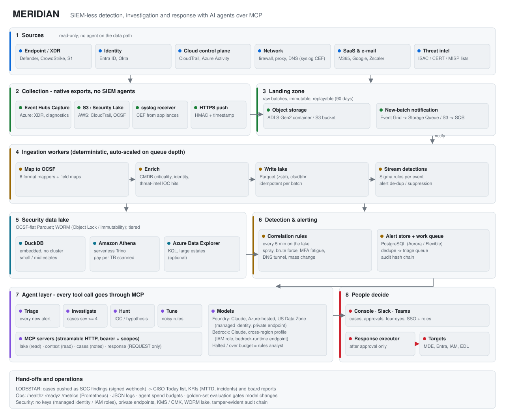

# MERIDIAN

**SIEM-less detection, investigation and response with AI agents over MCP.**

MERIDIAN replaces the SIEM layer with three parts:

* **A security data lake in your own cloud account.** It holds OCSF-normalised Parquet under WORM retention.
* **Deterministic, testable detection.** Sigma-compatible streaming rules plus correlations that run over the lake.
* **AI agents that triage, investigate and hunt.** They work only through scoped Model Context Protocol (MCP) tools.

Agents can read and they can *request* containment. A human approves every action.

It runs on **Microsoft Azure with Microsoft Foundry** or on **AWS with Amazon Bedrock**, from the same code and the same configuration model. It is the sibling product of [LODESTAR](https://github.com/manabouprj/Lodestar), and hands its cases to LODESTAR for CISO prioritisation and board reporting.

<picture>
  <source media="(prefers-color-scheme: dark)" srcset="docs/images/architecture-dark.svg">
  
</picture>

## Why

| | SIEM | MERIDIAN |
| --- | --- | --- |
| Licence | Per GB ingested (Sentinel analytics tier: about $4.30/GB pay-as-you-go) | None. Object storage, serverless query and bounded model spend |
| Data | Vendor store and schema | Your ADLS / S3 account, OCSF + Parquet, WORM |
| Triage | People read every alert | Triage agent on every alert; policy closes clear benign ones |
| Response | Playbooks with standing credentials | Agent requests, human approves (four-eyes), executor acts once |

Indicative platform cost at 200 GB/day: about $5.2k/month on Azure or $2.8k/month on AWS, against $16.7k/month for Sentinel. People costs decide the business case: on hard dollars, full replacement pays back above roughly 360-460 GB/day. Below that, the hybrid route and the analyst-time savings carry it. The [executive review](docs/EXECUTIVE_REVIEW.md) has the readiness verdict, phased plan, 3-year TCO and ROI. The model behind it is `scripts/cost_model.py`.

## Try it in two minutes (offline)

The demo uses a fictional estate (Kestrel Logistics, `*.example`) and the built-in deterministic analyst, so it needs no cloud account and no model.

```bash
python -m venv .venv && . .venv/bin/activate        # Windows: .venv\Scripts\Activate.ps1
pip install -r requirements.txt
python -m meridian demo --serve                     # http://127.0.0.1:8090 - one-time sign-in keys are printed
```

The demo ingests about 3,000 events, raises streaming and correlation alerts, triages them, and merges a phishing-to-ransomware chain into one malicious case. That case waits for approval to isolate the device and revoke the sessions. Approve it as the responder and watch the dry-run execution land in the hash-chained audit log.

## Deploy

| | Azure + Microsoft Foundry | AWS + Amazon Bedrock |
| --- | --- | --- |
| Terraform | [`infra/azure`](infra/azure) | [`infra/aws`](infra/aws) |
| Config | [`config/examples/azure.yaml`](config/examples/azure.yaml) | [`config/examples/aws.yaml`](config/examples/aws.yaml) |
| Design | [LLD-azure.md](docs/LLD-azure.md) | [LLD-aws.md](docs/LLD-aws.md) |
| Models | Claude in Foundry (managed identity) | Claude in Bedrock (IAM role) |
| Managed agents (optional) | Foundry Agent Service: MCP tool / Toolbox | AgentCore Gateway + Policy (Cedar) |

The production path (detailed in [OPERATIONS.md](docs/OPERATIONS.md)):

1. Build and push the image.
2. `terraform apply`.
3. Set the secrets in Key Vault / Secrets Manager. `/readyz` stays red while any placeholder is left.
4. Point exports at the landing zone.
5. Load your CMDB / identity CSVs.
6. Run `meridian doctor` and `meridian eval`.
7. Keep `response.dry_run: true` for the first two weeks.

## How it works

1. **Collect.** Six paths, all landing raw batches in object storage: cloud exports (Event Hubs Capture, CloudTrail / Security Lake to S3), streaming, a UDP/TCP/TLS syslog receiver (Windows via Event Forwarding + NXLog, Linux, network, OT), HTTPS push (HMAC, source tokens, Splunk HEC-compatible), API pull for SaaS, and shippers writing to Blob / S3. See [LOG-00](docs/pdf/MERIDIAN-LOG-00-Log-Ingestion-Normalisation-Retention.pdf).
2. **Ingest.** Queue-driven workers map to OCSF, enrich with asset criticality, identity and threat intel, write Parquet partitioned by class/day/hour, and run 21 streaming rules.
3. **Correlate.** Seven correlation rules (password spray, brute force, MFA fatigue, impossible travel, DNS tunnelling, mass file change, port scan) run every 5 minutes on DuckDB, Athena or ADX.
4. **Triage.** The triage agent reads every new alert through MCP and returns a validated verdict. Deterministic policy closes, keeps open, or joins/opens a case grouped by shared user or device.
5. **Investigate.** For severity >= 4 or malicious cases, the investigation agent builds the timeline, scope and root cause, cites query ids, and may request containment.
6. **Decide.** A responder approves in the console or from a Teams/Slack prompt. The executor then:
   * isolates the device with Defender;
   * revokes sessions or disables the user in Entra;
   * deactivates the AWS key or quarantines the EC2 instance;
   * publishes the indicator to the firewall EDL;
   * or calls your SOAR.

## Documentation

| | |
| --- | --- |
| Executive | [Executive review: readiness, phases, cost, TCO, ROI](docs/EXECUTIVE_REVIEW.md) |
| Releases and plan | [Changelog](CHANGELOG.md) · [Roadmap](docs/ROADMAP.md) (phases as GitHub milestones and issues) |
| Architecture | [HLD](docs/HLD.md) · [LLD Azure](docs/LLD-azure.md) · [LLD AWS](docs/LLD-aws.md) · [Security](docs/SECURITY.md) · [Peer review](docs/PEER_REVIEW.md) |
| Build documents (PDF) | [AZ-00 Azure + Foundry](docs/pdf/MERIDIAN-AZ-00-Foundry-Design-and-Deployment.pdf) · [AWS-00 AWS + Bedrock](docs/pdf/MERIDIAN-AWS-00-Bedrock-Design-and-Deployment.pdf): design, residency, setup to go-live, verification, agent constitutions (sources in [docs/cloud](docs/cloud)) |
| Log ingestion | [LOG-00 Log ingestion, normalisation, retention and rotation](docs/pdf/MERIDIAN-LOG-00-Log-Ingestion-Normalisation-Retention.pdf): six paths for hybrid estates, Windows/Sysmon, OCSF normalisation, per-class retention (source in [docs/ingestion](docs/ingestion)) |
| LODESTAR integration | [INT-00 MERIDIAN → LODESTAR](docs/pdf/MERIDIAN-LODESTAR-INT-00-Integration-Design-and-Deployment.pdf): HLD, contract, identity mapping, deployment, security, operations (source in [docs/integration](docs/integration)) |
| Detailed design | [Design index](docs/design/README.md): decisions (ADRs), components, data model, API, configuration, environment, detection engineering |
| Deployment | [Deployment index](docs/deployment/README.md): prerequisites, local / Azure / AWS runbooks, source onboarding, go-live checklist, upgrade and DR, troubleshooting |
| Operations | [Operations guide](docs/OPERATIONS.md) · [MCP tool reference](docs/MCP-TOOLS.md) |

## Commands

| Command | What it does |
| --- | --- |
| `meridian demo [--serve]` | Offline end-to-end demo |
| `meridian serve` | Console, API, MCP endpoints, ingest, EDL |
| `meridian worker` / `agents` / `scheduler` / `syslog` / `collect` | Background roles (`collect` = API pull collector) |
| `meridian map-test --file <sample> --format <mapper>` | Preview how a source normalises before it goes live |
| `meridian pull --source <key>` | Run one API collector now |
| `meridian query '<QuerySpec JSON>'` | Ad-hoc lake query (same compiler the agents use) |
| `meridian hunt --hypothesis "..." [--indicator x]` | Run the hunt agent |
| `meridian tune --rule <id>` | Ask the tune agent for a noise-reduction proposal (never applied automatically) |
| `meridian rules --check` | Validate the rule pack |
| `meridian eval [--min-accuracy 0.8]` | Golden-set triage evaluation (gate model and prompt changes) |
| `meridian replay --prefix <landing prefix>` | Re-process landing batches after a mapper or rule fix |
| `meridian doctor` | Configuration, connectivity and permission checks |
| `meridian verify-audit` | Verify the audit hash chain |

## Repository layout

```
meridian/            application (ingest, lake, detect, agents, mcp_servers, response, api, store)
config/              meridian.yaml (local), examples/azure.yaml, examples/aws.yaml, rules/ (Sigma)
infra/azure          Terraform: ADLS, Event Hubs, Event Grid, PostgreSQL, Key Vault, Foundry, Container Apps, ADX (opt.)
infra/aws            Terraform: S3 (Object Lock), SQS, Glue/Athena, Aurora, ECS Fargate, IAM, endpoints; AgentCore Cedar policy
docs/                executive review, HLD, LLDs, design/ (ADRs, components, data model, API...), deployment/ (runbooks), cost/,
                     cloud/ + integration/ + ingestion/ (PDF build sources), pdf/ (AZ-00, AWS-00, INT-00, LOG-00)
scripts/             cost model + charts, diagram and reference-doc generators, Word builder, signed push client, IaC checks
tests/               unit, integration and golden-set evaluation tests
```

## Status and honesty

Version 1.0.1 (1.0.0 plus the fixes in [CHANGELOG.md](CHANGELOG.md)) is a release candidate for a production pilot. Here is what has and has not been exercised:

* **Covered by the test suite:** the rules, the query compiler (SQL and KQL), the agent runtime guarantees, MCP authentication and scopes, approvals, and the end-to-end demo.
* **Verified without a live run:**
  * the Terraform passes `validate` against the real provider schemas (azurerm 5.7.0, aws 6.48.0, with OpenTofu 1.10.6);
  * it passes an offline `plan` with mocked providers (`infra/*/tests`).

  It has not been applied to a live subscription or account. Apply it to a non-production one first.
* **Database:** the test suite passes on SQLite and on PostgreSQL 16. CI runs both.
* **Tested with stubs and recorded responses, not live tenants:**
  * vendor adapters (Defender, Graph, AWS);
  * model providers (Foundry, Bedrock).

  Run the onboarding checklist before go-live.

Open items to confirm at deployment are listed at the end of each LLD.

## Licence

No licence file is included yet. Choose one (and add `LICENSE`) before publishing the repository.
