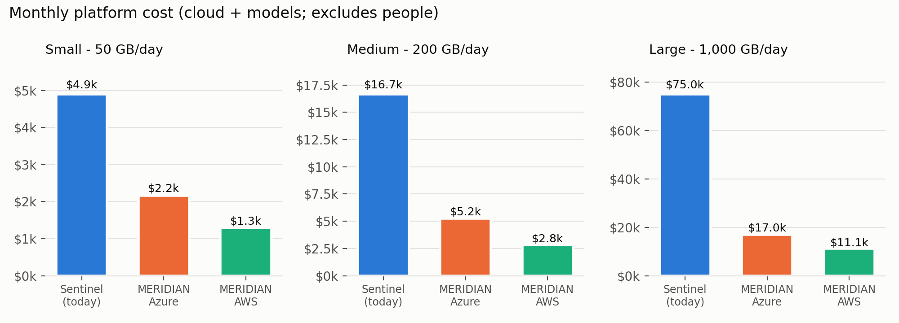
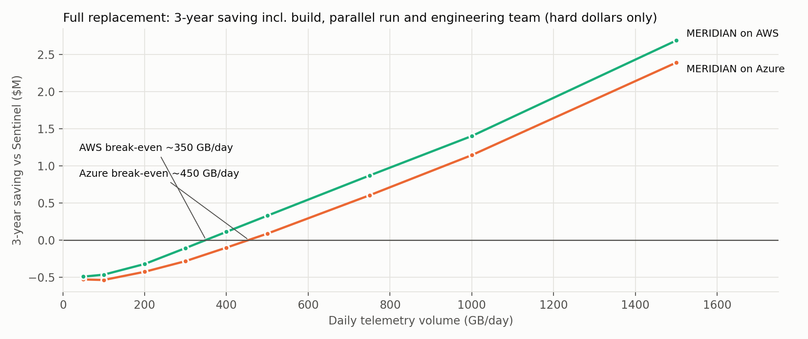

# MERIDIAN - Executive review: readiness, phased implementation, cost, TCO and ROI

| Item | Value |
| --- | --- |
| Subject | Replacing the SIEM layer with MERIDIAN (security data lake + detection rules + AI agents over MCP) |
| Audience | CISO, CIO, CFO, Head of SOC, Enterprise Architecture |
| Version / date | 1.0.0 / October 2026 |
| Basis | Independent technical review of MERIDIAN 1.0.0, a parametric cost model (`scripts/cost_model.py`) using public list prices, and public SIEM pricing |
| Status | For decision |

## 1. Executive summary

**The question.** Can MERIDIAN replace our SIEM from day one, and is it worth it?

**The short answer.** It is not a day-one replacement, but it is a sound platform for a phased one. Whether it pays off depends mainly on data volume.

1. **Readiness.** MERIDIAN 1.0.0 is production-grade *as a parallel platform*. Its security design is ready: the AI agents can only read data and *request* containment, a human approves every action, and the audit trail is tamper-evident. What is not ready on day one is everything a SOC relies on its SIEM for: breadth of detection content (30 rules), source onboarding proven on our own live feeds, analyst search and case workflow, and enough evidence that the AI triage can be trusted to close alerts on its own. Switching the SIEM off safely takes **9 to 15 months** of phased work. Section 3 has the scorecard.
2. **Running cost.** The monthly platform bill is **55 to 85% lower** than Microsoft Sentinel at every size we modelled. At 200 GB/day it is about **$5.2k/month on Azure or $2.8k/month on AWS, against $16.7k/month for Sentinel**. Azure costs more mainly because the AI models must run as Sonnet in the US data zone to meet the residency position (section 5). Section 5 has the details.
3. **Log ingestion, the part most SIEM projects get wrong.** MERIDIAN collects from on-premises, cloud and SaaS sources through six standard paths: cloud exports, streaming, syslog over TLS, Windows Event Forwarding with NXLog and Sysmon, HTTPS push (including Splunk-compatible senders) and API pull. Every record is kept raw for 90 days and normalised to one open schema, and nothing is dropped because a parser failed. Retention is set per log type and enforced by write-once storage, not bought as a licence tier. Section 2.1 explains how this differs from a SIEM; document LOG-00 is the technical design.
4. **Total cost and ROI.** The licence saving must pay for a larger engineering team (MERIDIAN is a platform we would own, not a service we buy), a one-year build-out and roughly nine months of running both systems. On hard dollars over three years:
   * **Below about 360-460 GB/day** (AWS / Azure), full replacement costs more than staying on Sentinel. At 200 GB/day the 3-year cost is $0.3-0.4M *higher*, although years 2 and 3 are already cheaper than the status quo.
   * **At 1 TB/day** it saves **$1.1-1.4M over three years**, with a **20-22 month payback** and a **191-265% return** on the year-1 investment.
   * If half of the analyst time the AI triage saves is counted, the break-even falls to about **105-130 GB/day**.

   Section 6 has the full analysis.
5. **Recommendation.**
   * Approve **Phases 0-1** now: about 3 months, with a year-1 net investment of roughly $0.25M at medium scale ($0.24M AWS, $0.26M Azure). This puts MERIDIAN into production *beside* the SIEM as a low-cost, long-retention security lake with AI-assisted triage.
   * Decide on full replacement at the **Phase 3 gate**, against measured data: detection parity, AI accuracy on our own alerts, and actual volumes.
   * For estates **above about 400-450 GB/day**, or facing a large SIEM renewal, plan for full replacement.
   * **Below that**, target the hybrid end state: high-volume, low-value logs move to MERIDIAN and the SIEM keeps a smaller commitment.



## 2. What MERIDIAN is, in one paragraph

MERIDIAN stores all security telemetry in our own cloud account (Azure Data Lake or Amazon S3) in an open format (OCSF on Parquet), under write-once retention. That storage costs cents per GB per month, compared with dollars per GB to ingest into a SIEM. Deterministic detection rules run on every event and on the lake every five minutes. AI agents built on Claude (in Microsoft Foundry or Amazon Bedrock) triage every alert, investigate serious cases and hunt on request. They work only through narrowly scoped tools (MCP servers), and they can *ask* for containment, never perform it. A responder approves each action, and the platform executes it once and records it in a hash-chained audit log. Cases flow into LODESTAR for CISO reporting.

### 2.1 Log ingestion: where SIEM projects struggle, and what MERIDIAN changes

Ingestion decides what a SOC can see, what it costs and how long the evidence lasts. In most SIEM programmes it is the largest source of cost overruns and blind spots.

| The usual SIEM problem | What it costs the business | How MERIDIAN handles it | Evidence |
| --- | --- | --- | --- |
| Licence priced per GB ingested, often with a daily cap | Firewall, DNS, flow and endpoint logs are filtered out to save money, and are then missing in an investigation | Logs are stored in our own cloud storage at cents per GB; there is no ingestion licence and no cap | Cost model, section 5 |
| Parsing at the edge: a vendor format change silently drops events | Gaps found only during an incident or an audit | Raw batches are kept for 90 days before parsing; a broken parser is fixed and the data replayed. Unrecognised records are kept, not dropped | Replay command; reject-rate metric; tests |
| A different schema per source and per tool | Rules and searches are rewritten for every vendor and every migration | One open schema (OCSF) for every source, query engine, rule and AI agent | 9 mappers; one column set |
| A proprietary agent on every server | Upgrade burden, change risk, licence count | No MERIDIAN agent: Windows Event Forwarding, standard syslog over TLS, cloud-native exports, or shippers we already run | LOG-00 §3–5 |
| Retention bought as a tier; old logs moved to an archive that cannot be searched | Regulators' retention met expensively, or not at all | Retention per log type (for example authentication 7 years, network flows 13 months), enforced by write-once storage; old data moves to cheaper tiers and stays searchable | Terraform variables, tested |
| Silent sources go unnoticed | A control fails without anyone knowing (PCI DSS 10.7) | Freshness, volume and reject rate per source are monitored and reported to LODESTAR | Metrics, runbooks |
| Leaving the SIEM means re-plumbing every source | Lock-in at renewal time | Standard protocols and a Splunk HEC-compatible endpoint: existing senders can be re-pointed source by source | HEC tests |

**What this does not remove.** Each source still has to be onboarded, previewed (`map-test`) and monitored, and SaaS sources without a dedicated mapper need their field map validated on live data. On Azure, devices that can only send UDP syslog need a small relay per site, because Azure Container Apps cannot receive UDP. These are Phase 1 tasks, sized in section 4.

## 3. Production-readiness verdict

### 3.1 Scorecard

| Area | Rating | Evidence | What closes the gap |
| --- | --- | --- | --- |
| Security architecture (agent boundary, approvals, audit) | **Ready** | Scoped MCP tools; request-only response; four-eyes approvals across all identity paths; hash-chained audit verified under concurrency; independent review findings fixed | Keep the evaluation gate in the release pipeline |
| Infrastructure as code (Azure, AWS) | **Ready with conditions** | Both stacks validate against real provider schemas and pass an offline plan; never applied to a live subscription or account | First live deployment in non-production (Phase 0) |
| Data lake, retention, cost | **Ready with conditions** | Write-once retention (WORM), tiered storage, cost model below | Lock the retention policy, add legal hold, compaction and cross-region replication |
| Platform reliability (HA, DR, upgrades, monitoring) | **Ready with conditions** | Scheduler now has a leader lock; heartbeats; silent-source metrics; tested on PostgreSQL | Schema migrations tool, alarms as code, a drilled DR exercise |
| AI triage in assist mode (recommendations only) | **Ready with conditions** | About 90 automated tests across the platform; degraded mode when the model is unavailable or over budget | Confirm inference residency with the DPO (see 3.3) |
| AI triage auto-closing alerts | **Not ready** | Golden set of only 10 labelled alerts; now limited to low-severity, non-crown-jewel alerts | 500+ labelled alerts from our own SOC; 4 weeks at >= 90% agreement |
| Detection content | **Not ready** | 30 rules; no lateral-movement coverage; a mature SIEM pack has 1,000+ rules | Port our top SIEM rules by true-positive value (Phase 2) |
| Source coverage | **Ready with conditions** | Six ingestion paths (cloud export, streaming, UDP/TCP/TLS syslog, HTTPS push with Splunk HEC compatibility, API pull, shippers) and 9 format mappers, including Windows/AD with Sysmon, Linux, CEF and LEEF; tested offline and in the demo, not yet on our live feeds; no e-mail mapper | Onboard sources with `map-test` evidence in Phase 1 (LOG-00 §10); build the e-mail mapper |
| Analyst experience (search, dashboards, case workflow, ITSM) | **Not ready** | Basic console; no ad-hoc search UI, SLAs or ServiceNow/Jira integration | Phase 4 |
| Compliance evidence (PCI DSS 10, ISO 27001, UAE IAS) | **Not ready** | Controls exist, but there is no coverage reporting and no auditor walkthrough yet | QSA/IAS pre-audit before decommission (Phase 5) |

### 3.2 What "production ready from day one" honestly means

* **Ready on day one, in production:**
  * a parallel, low-cost security lake with 365-day write-once retention;
  * streaming and correlation detections for the sources already supported;
  * AI-prepared triage and investigation notes for analysts;
  * human-approved containment in dry-run mode.

  None of this needs the SIEM to be switched off.
* **Not ready on day one:** being the SOC's system of record. A team that switched off its SIEM today would lose detection coverage, analyst search and audit evidence.

### 3.3 Material risks for executives

| Risk | Why it matters | Mitigation |
| --- | --- | --- |
| Detection regression at cutover | Missed incidents are the most expensive outcome | Parity gate: >= 95% of the last 12 months' SIEM true positives reproduced before decommission; SIEM kept read-only as a fallback |
| AI wrongly closes a true positive | Attackers can influence log content | Auto-close limited to low-severity, non-crown-jewel alerts (fixed in this release); weekly sampling; evaluation against our own labelled alerts |
| Cross-border AI inference | Claude is not offered for in-region inference in the UAE on either cloud. On **Azure**, inference is pinned to the **US data zone** (Azure-hosted Sonnet 5.5); on **AWS**, from me-central-1 it uses **global cross-region inference** (any supported commercial region), unless a geographic profile in another region is used | DPO and regulator sign-off on the residency sentence in AZ-00 / AWS-00 section 6; data minimisation (already built in); move to in-region inference when it is offered |
| Under-staffing | MERIDIAN is a platform we own | Fund the engineering team in section 6 (2-4 FTE steady state, plus 1-2 during build) |
| Single maintainer / young product | Version 1.0, internally developed | Internal ownership, code escrow or fork, documented support model, licence decision before wider use |
| Query cost at scale | As built, agent queries scan wide time windows; on AWS (Athena, priced per TB scanned) this can more than double the monthly bill | Phase 1 engineering work: file compaction, entity-sorted files and narrower query windows (the cost model assumes this is done; the as-built figure is shown for transparency) |

### 3.4 Fixed during this review

The review found four issues that were cheap to fix and material to readiness. All four are fixed and tested in this release:

* auto-close is now limited to rule severity <= 2 and never applies to crown-jewel assets;
* the scheduler has a leader lock, so running two replicas is safe;
* silent log sources are exposed as a metric (a PCI DSS 10.7 requirement);
* coverage reported to LODESTAR is now measured rather than hard-coded at 100%.

A later documentation cycle closed the ingestion gaps found by the same review: Windows/Active Directory and Sysmon, mixed syslog with TLS, token and Splunk HEC-compatible push, API pull for SaaS, and per-log-type retention (PEER_REVIEW R-41 to R-48).

## 4. Phased implementation

The plan runs MERIDIAN alongside the SIEM until measured exit criteria are met. Each gate is a go/no-go decision, so stopping after any phase still leaves something of value.

| Phase | Duration | Scope | Exit criteria (gate) | Value if we stop here |
| --- | --- | --- | --- | --- |
| **0. Foundation** | 4-6 weeks | Live deployment (non-production, then production) on the chosen cloud; lock retention; alarms; DR replication; residency decision for AI inference | Health checks green in production; DR restore drilled; DPO sign-off | Secure platform ready |
| **1. Shadow lake** | 6-8 weeks (parallel to SIEM) | Dual-feed high-volume sources (firewall, proxy, DNS, cloud audit); onboard Windows/AD (Event Forwarding, NXLog, Sysmon), Linux, network and OT syslog, Microsoft 365 and Okta through the built-in paths (LOG-00); build the e-mail mapper; query cost optimisation | >= 90% of in-scope sources flowing; 90-day hunt within agreed time | 365-day searchable retention at a fraction of SIEM cost; AI triage notes |
| **2. Detection parity** | 3-4 months (parallel) | Port top SIEM rules; fill tactic gaps; attack-simulation test harness | >= 95% of last year's SIEM true positives reproduced | Second detection layer; cheaper long-term retention |
| **3. AI trust** | 2-3 months (overlaps Phase 2) | 500+ labelled alerts from our SOC; calibration; drift monitoring; enable low-severity auto-close | >= 90% analyst agreement for 4 weeks; no missed incident in sampled auto-closures | Measurable analyst time saved. **Full vs hybrid decision taken here.** |
| **4. Operational parity** | 2-3 months (overlaps) | ServiceNow/Jira, case SLAs, search and dashboards, threat-intel feeds, live response adapters, SOC runbooks and training | SOC runs one full month on MERIDIAN as primary with the SIEM on standby | Ready to cut over |
| **5. Decommission** | At SIEM renewal | SIEM read-only, then retired; historical export to the lake | QSA / IAS pre-audit passed; two quarters without detection regression; executive risk acceptance | Licence saving realised |

```
Month:        1   2   3   4   5   6   7   8   9   10  11  12  13-15
Phase 0       ███
Phase 1          ████
Phase 2                ████████████
Phase 3                      ███████████
Phase 4                                  ███████████
Phase 5                                                  ██ (at renewal)
SIEM          ████████████████████████████████████████████░░ read-only -> off
```

**Team.** A platform/data engineer and a detection engineer from Phase 0. A second detection engineer from Phase 2. Part-time AI assurance (evaluation and drift) from Phase 3. Existing SOC analysts throughout. The cost model assumes 1-2 FTE more than the current SIEM team during the build year and 1 FTE more in steady state.

## 5. Monthly cost by cloud

Indicative monthly platform cost at list prices for UAE regions (US East list plus 15%), including AI model usage and excluding people. Enterprise agreements, reservations and savings plans typically lower the infrastructure lines by 20-40%.

### 5.1 Microsoft Azure + Microsoft Foundry

| Cost line | Small (50 GB/day) | Medium (200 GB/day) | Large (1 TB/day) |
| --- | --- | --- | --- |
| Lake + landing storage (ADLS, tiered, WORM) | $39 | $157 | $787 |
| Query engine (DuckDB small; Azure Data Explorer medium/large) | $181 | $1,265 | $6,900 |
| Ingestion (Event Hubs + Capture) | $222 | $232 | $941 |
| Compute (Container Apps) | $522 | $749 | $1,565 |
| Database (PostgreSQL Flexible, zone-redundant HA) | $316 | $632 | $1,331 |
| Networking (private endpoints) | $52 | $83 | $249 |
| Logs, Key Vault, Event Grid | $97 | $176 | $414 |
| AI models (Claude Sonnet 5.5 in Foundry, Azure-hosted, US Data Zone, both tiers) | $737 | $1,945 | $4,853 |
| **Total per month** | **$2,166** | **$5,239** | **$17,040** |
| Effective cost per GB ingested | $1.44 | $0.87 | $0.57 |

### 5.2 Amazon Web Services + Amazon Bedrock

| Cost line | Small (50 GB/day) | Medium (200 GB/day) | Large (1 TB/day) |
| --- | --- | --- | --- |
| Lake + landing storage (S3, tiered, Object Lock) | $60 | $231 | $1,129 |
| Query engine (Athena, after query optimisation) | $51 | $465 | $5,453 |
| Compute (ECS Fargate, Graviton) | $182 | $265 | $564 |
| Database (Aurora Serverless v2, 2 instances) | $230 | $472 | $1,013 |
| Networking (VPC endpoints, NAT, load balancer) | $345 | $355 | $410 |
| Logs, secrets, keys, queues | $46 | $63 | $115 |
| AI models (Claude in Bedrock, global cross-region inference: Haiku 4.5 triage, Sonnet 5.5 investigation) | $377 | $988 | $2,462 |
| **Total per month** | **$1,291** | **$2,839** | **$11,146** |
| Effective cost per GB ingested | $0.86 | $0.47 | $0.37 |

### 5.3 What we pay today (comparators)

| | Small | Medium | Large |
| --- | --- | --- | --- |
| Microsoft Sentinel, commitment tier ($3.23 / $2.74 / $2.46 per GB) + retention to 365 days | $4,905 | $16,678 | $74,992 |
| Splunk Enterprise Security, typical term licence range ($600-1,500 per GB/day per year) | $2,500-6,250 | $10,000-25,000 | $50,000-125,000 |

**How to read these numbers.**

* **AWS comes out cheaper** for two reasons. Athena is pay-per-query, while Azure's medium and large tiers run a dedicated Data Explorer cluster. And the Azure residency position (US data zone) requires Sonnet for triage, whereas AWS can use Haiku through global inference. The two clouds' residency positions differ; see AZ-00 and AWS-00 section 6. The Azure cluster buys faster interactive hunting, and both clouds are viable.
* **The query line depends on engineering.** As built today, before the Phase 1 optimisation, the AWS medium tier would be about $7.7k/month instead of $2.8k, because agent queries scan wide time windows.
* **AI model spend is capped** by a configurable daily budget. When the cap is reached, triage continues in a labelled degraded mode instead of failing.

## 6. Total cost of ownership and ROI (3 years)

### 6.1 Options compared

* **Status quo.** Keep Sentinel at a commitment tier plus the current SIEM engineering team.
* **Hybrid.** Move about 65% of volume (network, DNS, proxy and cloud audit) to MERIDIAN; the SIEM keeps the rest at a smaller commitment.
* **Full replacement.** MERIDIAN becomes the system of record; the SIEM is retired after the parallel run.

All options include 20% annual data growth, 5% annual SIEM price escalation, and fully loaded engineering staff at $140k per FTE. For MERIDIAN they also include the build team, one-off costs (assurance, penetration test, training) and the parallel run.

| Tier | Option | 3-year TCO (Azure) | 3-year TCO (AWS) | 3-year saving (Azure / AWS) | Payback |
| --- | --- | --- | --- | --- | --- |
| Small (50 GB/day) | Status quo | $0.65M | $0.65M | - | - |
| | Hybrid | $0.91M | $0.88M | -$0.27M / -$0.24M | Not within 3 years |
| | Full replacement | $1.18M | $1.14M | -$0.53M / -$0.49M | Not within 3 years |
| Medium (200 GB/day) | Status quo | $1.61M | $1.61M | - | - |
| | Hybrid | $1.80M | $1.72M | -$0.19M / -$0.11M | Not within 3 years (positive with productivity) |
| | Full replacement | $2.04M | $1.93M | -$0.43M / -$0.32M | About 5 years (hard dollars) |
| Large (1 TB/day) | Status quo | $4.72M | $4.72M | - | - |
| | Hybrid | $3.96M | $3.77M | **+$0.76M / +$0.95M** | 18 / 16 months |
| | Full replacement | $3.58M | $3.32M | **+$1.14M / +$1.40M** | 22 / 20 months |

**Full replacement in detail.**

| Tier | Year-1 extra investment (Azure / AWS) | Years 2-3 vs status quo | 3-year ROI on year-1 investment |
| --- | --- | --- | --- |
| Small | $0.35M / $0.34M | Still more expensive (more engineers than licence saved) | Negative |
| Medium | $0.55M / $0.52M | $37k-87k (Azure) / $71k-129k (AWS) cheaper per year, rising with growth | Negative within 3 years; break-even in about year 5 |
| Large | $0.60M / $0.53M | $0.75-0.99M (Azure) / $0.83-1.10M (AWS) cheaper per year | **191% / 265%** |

### 6.2 Break-even by volume



* **Hard dollars only:** full replacement breaks even at about **360 GB/day on AWS** and **460 GB/day on Azure** over three years, against a Sentinel commitment tier. Against a mid-range Splunk licence the break-even is a little lower, about 320 GB/day (AWS) and 400 GB/day (Azure).
* **With analyst productivity:** we assume the AI triage saves 4 minutes of analyst time on each alert that reaches a person, at $45/hour, and count only half of that. On this basis break-even falls to about **105-130 GB/day**, and the medium tier saves **$0.23M (Azure) to $0.33M (AWS) over three years**.
* **The people assumption decides the medium case.** If MERIDIAN is run by the current SIEM team, re-skilled rather than expanded, the medium tier breaks even within three years on hard dollars alone.

### 6.3 Value that is not in the numbers

* **Retention.** 365 days of searchable, write-once telemetry for a few cents per GB-month, so the full year is available for investigations, threat hunts and regulators. SIEMs usually keep only 90 days hot.
* **Speed.** Every alert is triaged within minutes, around the clock, with the evidence attached. The design targets detection in under 5 minutes and triage in under 3 minutes; these are to be measured in Phase 3.
* **Ownership and portability.** The data stays in our own account in open formats (OCSF, Parquet, Sigma, MCP). No proprietary lock-in, and the AI model is swappable.
* **Containment safety.** Every response action is approved by a human, executed once and recorded tamper-evidently. This is stronger governance than typical SOAR playbooks with standing credentials.
* **LODESTAR integration.** SOC cases and measured coverage feed CISO prioritisation and board reporting.

## 7. Recommendation and decisions requested

1. **Approve Phases 0-1** (about 3 months; for a 200 GB/day estate the year-1 net cost of this hybrid start is about $0.25M):
   * deploy MERIDIAN in production beside the SIEM;
   * onboard the high-volume sources;
   * enable AI-assisted triage, with no auto-close.
2. **Choose the cloud.** Use the one where the security tooling and identity already live. AWS is cheaper per month; Azure fits a Microsoft-centric estate (Defender, Entra, Sentinel migration path). Both are fully specified.
3. **Mandate the residency decision** for AI inference with the DPO in Phase 0.
4. **Fund the team:** one platform engineer and one detection engineer now, and a second detection engineer at Phase 2.
5. **Set the Phase 3 decision rule:**
   * go for **full replacement** if daily volume exceeds about 400 GB, or if the next SIEM renewal quote exceeds the full-replacement run cost plus one FTE;
   * otherwise settle on the **hybrid** end state and right-size the SIEM commitment at renewal.

## 8. Assumptions and sources

* **Infrastructure prices:** public list prices, US East, October 2026, with a 15% uplift for UAE North / me-central-1. Examples:
  * Fargate Graviton $0.0324 per vCPU-hour;
  * Aurora Serverless v2 $0.12 per ACU-hour;
  * Athena $5 per TB scanned;
  * Container Apps $0.0864 per vCPU-hour;
  * PostgreSQL Flexible D2ds_v5 about $130/month;
  * Event Hubs Capture $0.10 per throughput unit-hour.
* **Model prices:** Claude Haiku 4.5 at $1/$5 and Claude Sonnet 5.5 at $2/$10 per million input/output tokens.
  * Azure: both tiers Sonnet 5.5, Azure-hosted, US Data Zone Standard (x1.1), because Haiku 4.5 is offered only as Global Standard. Using Global Standard (Haiku for triage, list price) would save about $0.4k / $1.0k / $2.4k per month (small / medium / large), at the cost of weaker residency.
  * AWS: Haiku 4.5 for triage and Sonnet 5.5 for investigation, both through global cross-region inference from me-central-1, at list price.
* **Token usage:** about 25k input / 1.5k output tokens per triage and about 120k / 8k per investigation.
* **SIEM pricing:** Sentinel analytics tier $4.30/GB pay-as-you-go, with commitment tiers of about $2.46-3.23/GB and retention beyond 90 days at $0.026/GB-month. Splunk at $600-1,500 per GB/day per year.
* **Volumes:** 20% annual growth; Parquet compression 6:1; alerts per day of 300 / 800 / 2,000 for small / medium / large.
* **People:** $140k fully loaded per engineer (UAE market, our assumption).
  * SIEM team: 1 / 2 / 3 FTE.
  * MERIDIAN team: 2 / 3 / 4 FTE, plus 1 / 2 / 2 FTE during the build year.
* **One-off costs:** $60k / $120k / $200k.
* **Parallel run:** 9 months; for the hybrid option, 4 months.
* **Re-running the model:** every figure comes from `scripts/cost_model.py`. Change an assumption and run `python scripts/cost_model.py && python scripts/cost_charts.py` to regenerate the tables, the JSON (`docs/cost/cost_model.json`) and the charts.
* **Not quotes:** validate with the Azure pricing calculator, the AWS pricing calculator and your enterprise agreement before committing budget.
