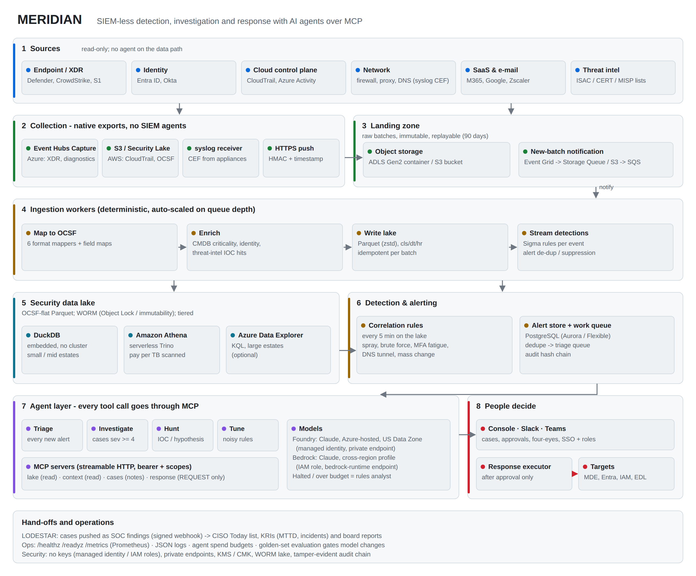
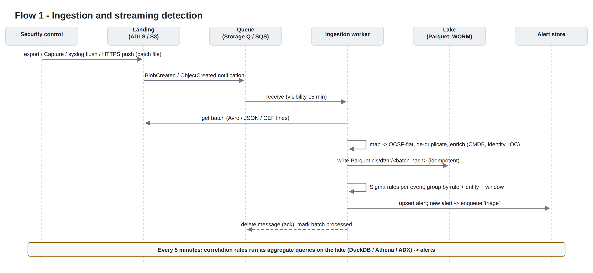
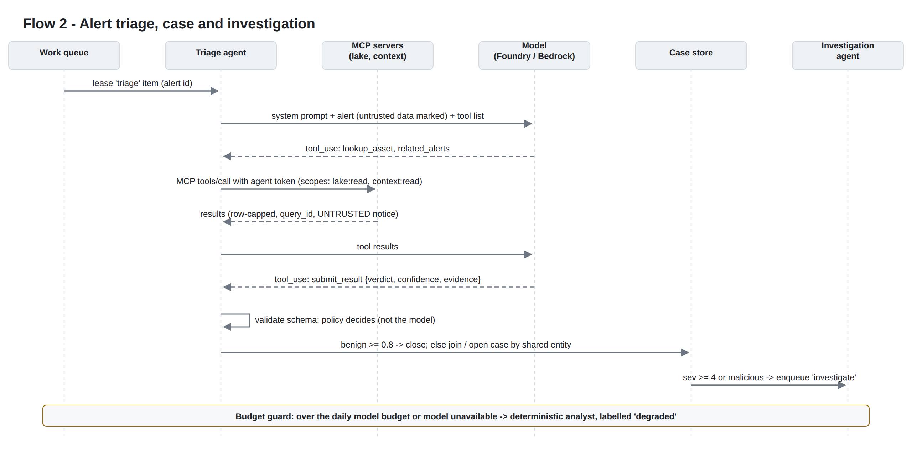
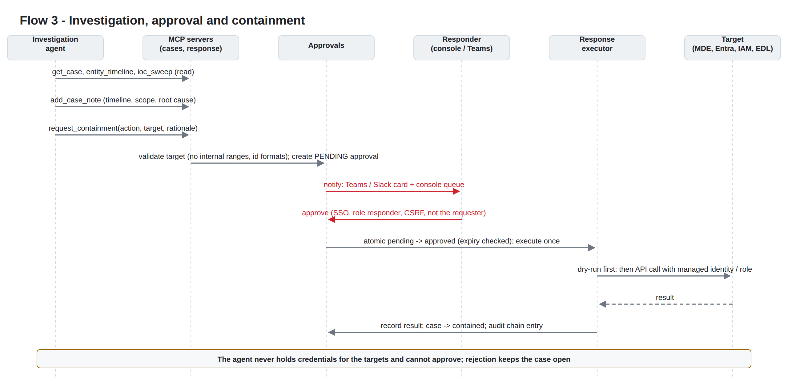
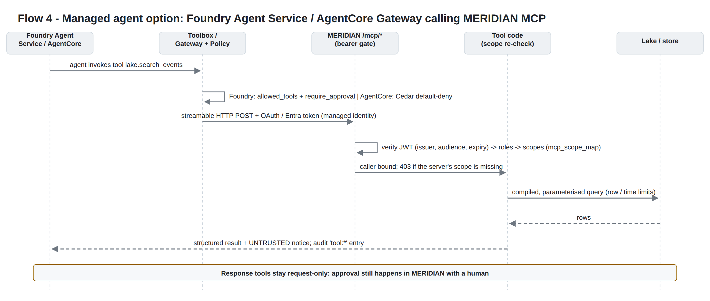

# MERIDIAN - High-Level Design

SIEM-less detection, investigation and response with AI agents over the Model Context Protocol (MCP).

| Item | Value |
| --- | --- |
| Product | MERIDIAN 1.0.1 (sibling product of LODESTAR) |
| Document | High-Level Design (HLD) |
| Deployment options | Microsoft Azure + Microsoft Foundry, or Amazon Web Services + Amazon Bedrock (equal depth) |
| Companion documents | LLD-azure.md, LLD-aws.md, SECURITY.md, OPERATIONS.md, MCP-TOOLS.md |
| Status | Release candidate for production pilot |

## 1. Purpose and scope

Many enterprises pay a SIEM licence that grows with every gigabyte they ingest, and they also pay for the infrastructure and the specialist people needed to keep the SIEM fed and tuned. A large share of that data is stored only for compliance and is rarely queried. MERIDIAN replaces the SIEM layer with three cheaper parts that each do one job well:

1. **A security data lake** in the organisation's own cloud account. Telemetry lands as files, is normalised to OCSF, and is stored as compressed Parquet under write-once retention. Storage costs cents per GB per month, and there is no per-GB ingestion licence.
2. **A deterministic detection layer**. Sigma-compatible rules run on every event as it is ingested, and correlation rules run every five minutes over the lake. This layer is predictable, testable and auditable, which is why it is not an LLM.
3. **AI agents that work through MCP**. They triage every alert, investigate serious cases, hunt on request and propose rule tuning. Agents can only read the lake and context through scoped MCP tools, and they can only *request* containment. A human approves every change.

In scope: ingestion, normalisation, enrichment, storage, detection, correlation, triage, case management, investigation, hunting, approval-gated response, the hand-off to LODESTAR, and operations on Azure or AWS.

Out of scope: replacing EDR/XDR sensors (they stay as data sources and response targets), SOAR replacement (MERIDIAN can call an existing SOAR), and full UEBA modelling (see section 13).

## 2. What changes compared with a SIEM

| Concern | Traditional SIEM | MERIDIAN |
| --- | --- | --- |
| Licence driver | Per GB/day ingested (e.g. Microsoft Sentinel analytics tier pay-as-you-go is published at about $4.30/GB) | No ingestion licence. You pay object storage, serverless query and model tokens |
| Storage | Proprietary hot store; long retention is an add-on | Parquet in your ADLS / S3 account, tiered, WORM (immutability / Object Lock) |
| Data model | Vendor schema | OCSF (open), flattened to 42 typed columns |
| Detection content | Vendor rule language | Sigma-compatible YAML that ports to and from other tools |
| Triage | Analysts read every alert | Triage agent reads every alert; policy closes clear benign ones, opens or joins cases for the rest |
| Investigation | Manual pivoting | Investigation agent builds timeline, scope and root cause, and cites evidence (query ids) |
| Response | Playbooks, often with standing credentials | Agent requests; human approves (four-eyes); executor acts once, with the platform identity |
| Lock-in | High | Open formats; engines (DuckDB, Athena, ADX) and models (Foundry, Bedrock) are swappable |

## 3. Architecture overview



The platform has eight layers:

| # | Layer | Responsibility | Key technology |
| --- | --- | --- | --- |
| 1 | Sources | Security controls that emit telemetry | Defender/CrowdStrike/S1, Entra/Okta, CloudTrail/Activity, firewalls, proxies, DNS, SaaS, threat intel |
| 2 | Collection | Native exports, so no SIEM agents are needed | Event Hubs Capture, S3/Security Lake, syslog receiver (UDP/TCP/TLS), HTTPS push (HMAC, source tokens, Splunk HEC), API pull, shippers to object storage (LOG-00) |
| 3 | Landing zone | Immutable raw batches, replayable for 90 days | ADLS Gen2 / S3 plus new-object notification |
| 4 | Ingestion workers | Map to OCSF, enrich, write the lake, run streaming rules | Python workers, auto-scaled on queue depth |
| 5 | Security data lake | Long-term, queryable, tamper-evident store | Parquet (zstd) partitioned cls/dt/hr; DuckDB, Athena or ADX |
| 6 | Detection and alerting | Correlation over windows, alert de-duplication, work queue | Scheduler + PostgreSQL |
| 7 | Agent layer | Triage, investigate, hunt, tune | Agent runtime + four MCP servers + Claude in Foundry / Bedrock |
| 8 | People decide | Cases, approvals, response execution | Web console (SSO), Teams/Slack, response executor |

### 3.1 Design principles

1. **Deterministic first, AI second.** Rules decide what is an alert. Agents decide what an alert *means* and what to do next. Policy, not the model, decides whether an alert is auto-closed.
2. **Agents never hold credentials for targets.** They call MCP tools. The response server can only create approval requests. Execution happens after human approval, inside the API service, using the platform identity.
3. **Everything an agent sees from telemetry is untrusted.** Tool results carry an explicit UNTRUSTED notice, and the system prompt tells the model to treat log content as data. Tool scopes limit the damage a successful prompt injection could do to read-only queries.
4. **Open formats and replaceable parts.** OCSF + Parquet + Sigma + MCP. The query engine and the model provider are configuration choices.
5. **Production by default.** No secrets in configuration, managed identity / IAM roles, private networking, WORM retention, hash-chained audit, health and metrics endpoints, budget guards and a degraded mode.

### 3.2 Components

| Component | Process | Function |
| --- | --- | --- |
| api | `meridian serve` | Console, REST API, MCP endpoints (`/mcp/lake`, `/mcp/context`, `/mcp/cases`, `/mcp/response`), signed ingest, EDL feed, approvals and response execution |
| worker | `meridian worker` | Consumes landing notifications, normalises, enriches, writes Parquet, evaluates streaming rules, enqueues triage |
| agents | `meridian agents` | Leases triage / investigate work items and runs agents against the model and the MCP servers |
| scheduler | `meridian scheduler` | Correlation rules every 5 minutes (with catch-up), approval expiry, LODESTAR push |
| syslog | `meridian syslog` | UDP/TCP/TLS (RFC 6587 / 5425 octet counting, optional mutual TLS) receiver that flushes batches to the landing zone |
| collect | `meridian collect` | API pull collector for SaaS audit APIs (cursor, pagination, OAuth2), one active replica |
| store | PostgreSQL | Alerts, cases, notes, approvals, agent runs, work queue, blocklist, cursors, audit chain |
| lake | ADLS Gen2 / S3 | Landing (raw) and lake (Parquet), with lifecycle tiering and WORM |

## 4. Data architecture

### 4.1 Normalised event model

Every event is mapped to an OCSF class and flattened into one wide, typed table. The flat model keeps queries simple for rules and agents and keeps Parquet column pruning effective.

| OCSF class | uid | Typical sources |
| --- | --- | --- |
| File System Activity | 1001 | EDR file events, ransomware notes |
| Process Activity | 1007 | EDR process creation |
| Detection Finding | 2004 | XDR / AV alerts, GuardDuty-style findings |
| Account Change | 3001 | User and group changes |
| Authentication | 3002 | Entra / Okta sign-ins, console logins |
| User Access Management | 3005 | Role assignments, OAuth consent |
| Network Activity | 4001 | Firewall CEF |
| HTTP Activity | 4002 | Proxy, WAF |
| DNS Activity | 4003 | Resolver, DNS firewall |
| Email Activity | 4009 | Mail gateways |
| API Activity | 6003 | CloudTrail, Azure Activity, SaaS audit |

Key columns include `time`, `class_uid`, `severity_id`, `user`, `src_ip`, `dst_ip`, `dst_port`, `dst_domain`, `device`, `device_id`, `process_name`, `process_cmdline`, `file_sha256`, `url`, `dns_query`, `api_operation`, `resource`, `tags`, `ioc_hits`, `event_uid` and `raw`. The full list is returned by the `describe_schema` MCP tool.

### 4.2 Storage layout

```
landing/<source>/<yyyy>/<mm>/<dd>/<batch>.jsonl.gz      raw, as delivered (90 days)
lake/events/cls=<class_uid>/dt=<YYYY-MM-DD>/hr=<HH>/<batch-hash>.parquet
```

* The batch file name is derived from the landing key, so re-processing a batch rewrites the same object. Ingestion is therefore idempotent, and a processed-batch table prevents double counting.
* Partitioning by class, day and hour lets every query prune to the classes and hours it needs. Athena uses partition projection, so no partition maintenance is needed.
* Retention: the lake is WORM for the configured period (default 365 days). Landing data expires after 90 days.

### 4.3 Enrichment

Before an event is written it is enriched from three context sources that the organisation maintains:

| Context | Format | Adds |
| --- | --- | --- |
| Assets | CSV (CMDB export) | `asset:<name>`, `crit:<1-5>`, `crown_jewel`, `internet_facing` tags |
| Identities | CSV (HR / IdP export) | `identity:<dept>`, `privileged_user` tags |
| Threat intel | CSV, STIX 2.1 JSON or plain lists | `ioc` tag and `ioc_hits` (IPs, domains including parent domains, hashes, URLs) |

## 5. Detection architecture

* **Streaming rules** run inside the worker on every event. MERIDIAN uses a Sigma-compatible subset: logsource mapping, selections, field modifiers (`contains`, `startswith`, `endswith`, `re`, `cidr`, `all`, `gt`/`lt`), and the full condition grammar (`and`, `or`, `not`, `1 of`, `all of`, parentheses).
* **Correlation rules** (`event_count`, `value_count`, grouped by entity, within a window) compile to a `QuerySpec` and run on the lake every 5 minutes. The scheduler persists the end of the last evaluated window, and after downtime it catches up from there (up to 24 hours), so a missed window is evaluated late rather than lost.
* **Alert identity** is a hash of the rule, the entity and the time bucket, so repeated matches update one alert (count, last seen, samples) instead of creating noise.
* **Content**: 30 rules ship with the product (endpoint, identity, AWS, network, and 7 correlations). `meridian rules --check` validates every rule in CI.

## 6. Agent and MCP architecture

### 6.1 Agents

| Agent | Trigger | Model tier | Tools (MCP) | Output (validated schema) |
| --- | --- | --- | --- | --- |
| Triage | Every new alert | fast | lake: search, aggregate, timeline; context: all | verdict, confidence, severity, entities, evidence, recommended next step |
| Investigate | Case severity >= 4, or a malicious verdict | deep | lake, context, cases, response (request only) | summary, timeline, scope, root cause, containment requested, evidence |
| Hunt | Analyst request (console/API, queued to the agents service; or CLI) | deep | lake, context | findings with query ids, new rule suggestions |
| Tune | Noisy rule (scheduled or on demand) | fast | lake, get_alert | proposed exclusions with impact estimate (never applied automatically) |

Every run is bounded by turn, tool-call, token, time and cost limits, for example triage at 6 turns / 8 tool calls and investigation at 12 turns / 20 tool calls. The agent must finish by calling `submit_result`, and its arguments are validated against a pydantic schema. Invalid output is rejected and the run is recorded as failed.

### 6.2 MCP servers

| Server | Scope | Tools | Side effects |
| --- | --- | --- | --- |
| lake | `lake:read` | describe_schema, search_events, aggregate_events, entity_timeline, ioc_sweep | None (row cap 200, window cap 30 days per call) |
| context | `context:read` | lookup_asset, lookup_identity, check_indicator, get_alert, related_alerts | None |
| cases | `cases:read`, `cases:write` | get_case, add_case_note | Notes only |
| response | `response:request` | list_actions, request_containment | Creates a PENDING approval, nothing else |

The servers use the MCP Python SDK and are served as stateless streamable HTTP under `/mcp/<server>/`. They are protected by bearer authentication that accepts three credential types: agent tokens (each with explicit scopes), console API keys (scopes derived from the role), or OIDC JWTs from Entra ID / your IdP (scopes mapped from app roles). The same servers run in-process for the built-in agent runtime and remotely for managed agent services.

### 6.3 Two ways to run agents

| Mode | How it works | When to use |
| --- | --- | --- |
| Built-in runtime (default) | The `agents` service calls the model directly (Claude in Foundry or Bedrock) and the MCP servers in-process | Simplest; everything stays inside your VNet/VPC; deterministic limits |
| Managed agent service | Microsoft Foundry Agent Service (MCP tool / Toolbox with approval settings), or Amazon Bedrock AgentCore Gateway (MCP targets + Cedar policy), calls MERIDIAN's `/mcp/*` endpoints with OAuth tokens | Your platform team standardises on Foundry or AgentCore, or you want their tracing and evaluation tooling |

In both modes MERIDIAN re-checks scopes and limits on every call. The response server stays request-only, so a managed agent can never execute containment.

### 6.4 Model choices

| Cloud | Default fast model | Default deep model | Auth | Alternative |
| --- | --- | --- | --- | --- |
| Azure | Claude Sonnet 5.5, Hosted on Azure, US Data Zone Standard (Haiku 4.5 is Global Standard only) | Claude Sonnet 5.5, same deployment type | Managed identity (Entra), local auth disabled | Global Standard (Haiku for triage) if the DPO accepts any-region processing; `foundry_openai` for OpenAI-compatible deployments |
| AWS | Claude Haiku 4.5, global cross-region inference profile from me-central-1 | Claude Sonnet 5.5, global cross-region inference profile | IAM task role; profile and model ARNs allow-listed; private bedrock-runtime endpoint | Geographic profile (eu./us.) in another region to pin processing to one geography; `bedrock_converse` for any Converse model |

Model names are configuration. Residency differs by cloud and is the subject of section 6 of the cloud documents (MERIDIAN-AZ-00, MERIDIAN-AWS-00): on Azure, inference is pinned to the US data zone; on AWS from me-central-1, Claude is reached through global cross-region inference. Neither cloud offers in-region Claude inference in the UAE today.

**Degraded mode.** If today's spend reaches `agents.daily_budget_usd`, or the model endpoint fails, triage falls back to the built-in deterministic analyst. Its verdicts are labelled `degraded` and never auto-close alerts at high confidence, so detection and case creation continue during a model outage.

## 7. Key flows

### 7.1 Ingestion and streaming detection



1. A control exports a batch to the landing zone (Event Hubs Capture Avro, S3 object, syslog flush, or signed HTTPS push).
2. A storage event notifies the queue, and a worker receives the message.
3. The worker reads the batch, maps each record to OCSF, removes duplicate `event_uid`s, enriches, and writes Parquet.
4. Streaming rules evaluate each event. New alerts are upserted and a `triage` work item is queued.
5. The message is acknowledged only after the batch is marked processed. A failure makes the message visible again, and after the maximum number of receives it moves to the dead-letter queue (AWS) or the poison queue (Azure).

### 7.2 Triage and case creation



The policy after triage is deterministic:

| Verdict | Confidence | Action |
| --- | --- | --- |
| benign | >= 0.8, rule severity <= 2, no crown-jewel asset, not degraded | Alert closed as benign, with rationale stored |
| benign | any other case | Kept open for an analyst |
| suspicious / malicious | any | Joined to an open case that shares a user or device within 24 h, or a new case is opened if severity >= 3 |
| malicious, or case severity >= 4 | any | `investigate` work item queued |

### 7.3 Investigation, approval and containment



* Approvals expire after 24 hours by default.
* Only `responder` and `admin` roles can decide, and the requester cannot approve their own request (four-eyes). Identities are compared in canonical form, so the same person is recognised whether they acted through the console, the REST API or MCP.
* The decision is atomic (pending and unexpired, then approved), so an approval executes exactly once.
* Every action runs as a dry run first unless the action is configured otherwise. Supported actions:
  * `isolate_device` (Defender for Endpoint)
  * `revoke_sessions` and `disable_user` (Microsoft Graph)
  * `block_indicator` (internal EDL served to firewalls and proxies)
  * `aws_deactivate_access_key`
  * `aws_quarantine_instance`
  * `soar_playbook` (signed webhook)

### 7.4 Managed agent services calling MERIDIAN MCP



## 8. Security architecture

### 8.1 Identity and access

| Principal | Authenticates with | Gets |
| --- | --- | --- |
| Analysts / responders | OIDC SSO (Entra ID, Okta, Cognito); group-to-role mapping | viewer / analyst / responder / admin |
| Automation | API keys (`MERIDIAN_API_KEYS`, constant-time comparison) | A role |
| Built-in agents | In-process call with an agent caller and explicit scopes | Only the scopes of their agent definition |
| Managed agents | OAuth / Entra JWT (audience = MERIDIAN MCP app) | Scopes from `mcp_scope_map` |
| Platform to cloud | Managed identity (Azure) / IAM task roles (AWS) | Least-privilege data and model access |
| Ingest senders | HMAC-SHA256 over `timestamp.body`, 5-minute window, per-source secret | Write to the landing zone only |

### 8.2 Threat model (summary)

| Threat | Control |
| --- | --- |
| Prompt injection through log content (for example a malicious command line or user agent) | Results are marked UNTRUSTED; the system prompt treats data as data; read-only scopes; response is request-only; human approval; validated output schema |
| Agent tool misuse or runaway loops | Allow-listed tools per agent, turn / tool-call / token / time / cost limits, query row and window caps |
| Query injection | Agents never write SQL/KQL; QuerySpec is validated against a field allow-list and compiled with bound parameters and quoted identifiers |
| Containment of the wrong target | Target validators (no internal ranges, no networks wider than /24, ID formats); dry-run first; four-eyes; AWS actions limited to resources tagged `meridian-containable=true` |
| Credential theft | No keys in configuration; managed identity / IAM roles; secrets in Key Vault / Secrets Manager; Foundry local auth disabled |
| Data exfiltration through the model | Private endpoints / VPC endpoints; model invocation limited to allow-listed deployments / ARNs; minimal fields sent per tool call |
| Tampering with evidence | Lake WORM; audit table is a SHA-256 hash chain (`meridian verify-audit`) |
| Log flooding / cost attack | Ingest size caps (10 MB per push), queue-based back-pressure, per-run and daily model budgets |
| Model outage | Degraded deterministic analyst; detection and case creation are unaffected |

See SECURITY.md for the full control list and residual risks.

## 9. Non-functional requirements

| Requirement | Target (reference deployment) | How it is met |
| --- | --- | --- |
| Detection latency (streaming rules) | < 5 min from export to alert | Event-driven queue, worker auto-scaling |
| Detection latency (correlations) | <= 10 min | 5-minute schedule over hour partitions |
| Triage latency | < 3 min per alert (p95) | Dedicated agents service, fast model tier |
| Throughput | 100-500 GB/day per worker pool (scale out) | Stateless workers, partitioned writes |
| Availability | 99.9% for the console and API | Multi-replica api, zone-redundant DB and storage |
| RPO / RTO | RPO 0 for the lake (WORM, replicated storage), RPO <= 5 min for the store (PITR); RTO 4 h | Geo-redundant backups, IaC rebuild, landing replay |
| Retention | 365 days WORM (configurable), 90 days raw | Immutability policy / Object Lock, lifecycle tiering |
| Auditability | Every tool call, decision and action recorded | Hash-chained audit, agent run records |

## 10. Cost model (indicative)

The figures below use public list prices from late 2026 and simple assumptions. They are not a quote. Replace the assumptions with your volumes and your price sheets.

**Assumptions:**

* 100 GB/day raw telemetry.
* Parquet + zstd compression gives about 6:1, so roughly 17 GB/day is written to the lake.
* 365-day retention.
* 500 alerts/day reach triage and 20/day are investigated.

| Cost line | Microsoft Sentinel (analytics tier) | MERIDIAN on Azure or AWS |
| --- | --- | --- |
| Ingestion licence | 100 GB x 30 x $4.30 = about $12,900/month PAYG; about $8,900 with a 100 GB/day commitment tier (about $2.96/GB) | $0 |
| Storage | Included for 90 days, then extra | About 6 TB of Parquet after a year, tiered (cool/IA then archive): low hundreds of $/month |
| Query | Included (analytics tier) | DuckDB: compute only. Athena: $5 per TB scanned, partition-pruned; low hundreds of $/month for 5-minute correlations |
| Compute | n/a (SaaS) | 4-5 small containers (about 4-6 vCPU total): about $250-400/month |
| Database | n/a | PostgreSQL Flexible / Aurora Serverless v2: about $200-400/month |
| Networking | n/a | Private endpoints / interface endpoints: about $100-250/month |
| Model tokens | Copilot / add-ons priced separately | Bounded by `daily_budget_usd` (default $50/day, at most about $1,500/month); typically a fraction of that with a fast model for triage |
| **Indicative total** | **about $8,900-12,900/month for ingestion alone** | **about $1,500-3,000/month all-in** |

What the comparison leaves out, in fairness:

* SIEM suites include UEBA, a large content hub, SOAR and vendor support.
* MERIDIAN is a platform we own: it needs a platform engineer and detection engineers (2-4 FTE in steady state at enterprise scale, more during the build year). These people costs decide the business case at small and medium volumes; see EXECUTIVE_REVIEW.md section 6 for the 3-year TCO, ROI and break-even analysis.
* Some SIEM offers include free data grants (for example certain Microsoft 365 log types).

**Amazon Security Lake.** On AWS you can collect natively through Amazon Security Lake. It charges $0.75/GB to ingest CloudTrail management events, $0.25/GB for other AWS sources, and $0.035/GB for normalisation; bringing your own data is free apart from S3 storage. MERIDIAN reads Security Lake OCSF data directly.

## 11. Migration from a SIEM

The migration runs MERIDIAN beside the SIEM until measured gates are passed. Realistic duration: **9 to 15 months** to decommission, depending on content and connector gaps. EXECUTIVE_REVIEW.md section 4 holds the plan, its exit criteria and the value delivered at each stage.

| Phase | Duration | Gate |
| --- | --- | --- |
| 0. Foundation | 4-6 weeks | Live deployment healthy; DR restore drilled; residency of model inference approved |
| 1. Shadow lake | 6-8 weeks | >= 90% of in-scope sources flowing (dual-fed with the SIEM); 90-day hunt within the agreed time |
| 2. Detection parity | 3-4 months | >= 95% of the last 12 months' SIEM true positives reproduced |
| 3. AI trust | 2-3 months (overlaps 2) | >= 90% analyst agreement for 4 weeks on 500+ labelled alerts; no missed incident in sampled auto-closures. **Full vs hybrid decision** |
| 4. Operational parity | 2-3 months (overlaps) | One month with MERIDIAN as the SOC's primary tool, SIEM on standby |
| 5. Decommission | At SIEM renewal | QSA / IAS pre-audit passed; two quarters without detection regression; SIEM data exported to the lake |

## 12. Deployment options

| Aspect | Azure + Microsoft Foundry | AWS + Amazon Bedrock |
| --- | --- | --- |
| Compute | Azure Container Apps (internal environment) | ECS on Fargate (ARM64) |
| Landing / lake | ADLS Gen2 (HNS), immutability policy | S3 with Object Lock, SSE-KMS |
| Notification | Event Grid to Storage Queue | S3 notification to SQS (+ DLQ) |
| Query engine | DuckDB (default) or Azure Data Explorer | Amazon Athena (Glue + partition projection) or DuckDB |
| Database | PostgreSQL Flexible Server (zone-redundant HA) | Aurora PostgreSQL Serverless v2 |
| Secrets | Key Vault (RBAC) | Secrets Manager (KMS) |
| Model | Claude in Microsoft Foundry (AIServices account, deployments) | Claude in Amazon Bedrock (Messages API) |
| Managed agents (optional) | Foundry Agent Service: MCP tool / Toolbox | Bedrock AgentCore: Gateway + Policy (Cedar) |
| Native telemetry | Defender XDR streaming API, Entra / Activity diagnostics to Event Hubs | Organisation CloudTrail, Security Lake |
| IaC | `infra/azure` (azurerm ~> 5.7) | `infra/aws` (aws ~> 6.10) |

Details are in LLD-azure.md and LLD-aws.md.

## 13. Known limitations and assumptions

* The Sigma subset covers the constructs used by most rules. Unsupported constructs are rejected with an error at load time, never silently ignored.
* There is no UEBA baseline modelling. Behavioural detections are correlation rules (thresholds, distinct counts) and agent judgement.
* Tested with recorded API responses and stubs, not live tenants:
  * mappers and response adapters for Defender, Graph and AWS;
  * model providers.

  Run the onboarding checklist in OPERATIONS.md against your tenant before go-live.
* The Terraform passes `validate` against the real provider schemas (azurerm 5.7.0, aws 6.48.0) and an offline `plan` with mocked providers; CI repeats both. It has not been applied to a live subscription or account; apply it first to a non-production one.
* Check model availability, quotas and pricing for your region. The Foundry deployment format for Claude models and the exact Bedrock IAM actions for the Messages endpoint should be confirmed against current documentation at deployment time (they are marked in the Terraform).
* Agents propose; humans decide. MERIDIAN is designed so that no configuration lets an agent execute containment.

## 14. Glossary

| Term | Meaning |
| --- | --- |
| MCP | Model Context Protocol: an open protocol for exposing tools and data to AI models |
| OCSF | Open Cybersecurity Schema Framework |
| WORM | Write once, read many (immutability policy / S3 Object Lock) |
| EDL | External dynamic list: a plain-text block list that firewalls pull |
| QuerySpec | MERIDIAN's validated, engine-neutral query description |
| Four-eyes | The requester of an action cannot approve it |
