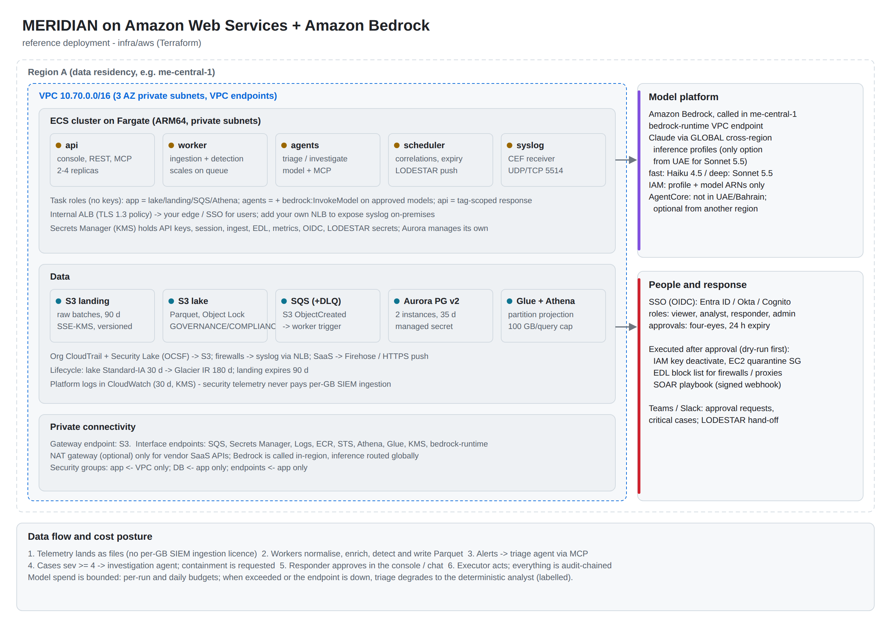

# MERIDIAN on Amazon Web Services + Amazon Bedrock - Low-Level Design

| Item | Value |
| --- | --- |
| Product | MERIDIAN 1.0.1 |
| Document | Low-Level Design, AWS option |
| IaC | `infra/aws` (Terraform >= 1.9, aws ~> 6.10) |
| Runtime config | `config/examples/aws.yaml` (`MERIDIAN_CONFIG`) |
| Related | HLD.md, LLD-azure.md, SECURITY.md, OPERATIONS.md, MCP-TOOLS.md |

## 1. Deployment view

The reference deploys into one security-tooling account (recommended: the delegated administrator / log archive pattern of AWS Organizations) in the data-residency region (`region`). Bedrock can be invoked in another region (`bedrock_region`) when the chosen Claude models are not offered in the home region.

## 2. Resource inventory

| Terraform resource | Name pattern | Configuration | Purpose |
| --- | --- | --- | --- |
| `aws_vpc.v` | `vpc-<prefix>` | `vpc_cidr` (default 10.70.0.0/16), DNS support and hostnames | Private network |
| `aws_subnet.private` (x3) | `snet-<prefix>-private-<n>` | /20 per AZ | Tasks, Aurora, endpoints |
| `aws_subnet.public`, `aws_nat_gateway.nat`, `aws_eip.nat`, `aws_internet_gateway.igw` | - | Only when `nat_gateway = true` | Egress to vendor SaaS APIs |
| `aws_vpc_endpoint.s3` | - | Gateway | S3 without NAT |
| `aws_vpc_endpoint.iface` (x10) | - | sqs, secretsmanager, logs, ecr.api, ecr.dkr, sts, athena, glue, kms, bedrock-runtime; private DNS | AWS APIs without NAT |
| `aws_kms_key.k` + alias | `alias/<prefix>` | Rotation enabled; key policy grants CloudWatch Logs, S3 (event notifications to the encrypted queue) and CloudTrail (`cloudtrail_account_ids`) | S3, SQS, Secrets, logs, Aurora |
| `aws_s3_bucket.landing` | `<prefix>-landing-<sfx>` | Versioned, SSE-KMS, public access blocked, expire 90 d, non-current 7 d; bucket policy: TLS only, CloudTrail delivery under `AWSLogs/` | Raw batches |
| `aws_s3_bucket.lake` | `<prefix>-lake-<sfx>` | Object Lock (`object_lock_mode`, `lake_retention_days`), versioned, SSE-KMS, Standard-IA 30 d, Glacier IR 180 d; bucket policy: TLS only | Parquet lake (WORM) |
| `aws_s3_bucket.athena` | `<prefix>-athena-<sfx>` | SSE-KMS | Athena query results |
| `aws_s3_bucket_notification.landing` | - | `s3:ObjectCreated:*` to SQS | New batch notification |
| `aws_sqs_queue.landing` / `.dlq` | `<prefix>-landing`, `<prefix>-landing-dlq` | Visibility 900 s, KMS, redrive after 5 receives, DLQ retention 14 d | Work notifications |
| `aws_glue_catalog_database.db` / `aws_glue_catalog_table.events` | `<prefix>` / `events` | External Parquet table, partition projection (`cls` enum, `dt` date, `hr` 00-23) | Athena schema |
| `aws_athena_workgroup.wg` | `<prefix>` | Enforced configuration, SSE-KMS results, 100 GB per-query scan cutoff | Query engine |
| `aws_rds_cluster.db` + 2 instances | `<prefix>-db` | Aurora PostgreSQL 16.6, Serverless v2 0.5-8 ACU, managed master secret, 35-day backups, deletion protection, KMS | Operational store |
| `aws_secretsmanager_secret.s` (x8) | `<prefix>/<name>` | KMS | Application secrets |
| `aws_ecs_cluster.c` | `<prefix>` | Container Insights | Compute |
| `aws_ecs_task_definition.t` / `aws_ecs_service.s` (x6) | `<prefix>-<role>` | Fargate, ARM64, read-only root FS, non-root | api, worker, agents, scheduler, syslog, collector (API pull) |
| `aws_security_group.alb` / `.app` / `.db` / `.endpoints` | `sg-<prefix>-*` | ALB: 443 from `client_cidrs`; app: 8090 from the ALB only, 5514 tcp+udp from `syslog_cidrs`; db: 5432 from app; endpoints: 443 from app | Network isolation |
| `aws_lb.api` + listener + target group | `<prefix>-api` | Internal ALB, HTTPS 443, `ELBSecurityPolicy-TLS13-1-2-2021-06`, health check `/readyz` (a half-configured task never receives traffic) | Console and API |
| `aws_appautoscaling_*` | - | Worker 1-20 tasks, target 50 visible messages per task | Queue-driven scaling |
| `aws_cloudwatch_log_group.lg` | `/meridian/<prefix>` | 30 days, KMS | Platform logs |
| `aws_iam_role.exec`, `.app`, `.agents` + policies | `<prefix>-ecs-exec`, `-app`, `-agents` | See section 4 | Least-privilege task roles |
| `agentcore-policy.cedar` (file) | - | Default-deny Cedar policy for AgentCore Gateway | Optional managed-agent mode |

## 3. Network design

| Subnet | CIDR (default) | Contents | Inbound | Outbound |
| --- | --- | --- | --- | --- |
| private-0..2 | 10.70.0.0/20, 10.70.16.0/20, 10.70.32.0/20 | ECS tasks, Aurora, interface endpoints | VPC only: 8090 (ALB to api), 5514 (syslog), 5432 (DB from app SG), 443 (endpoints from app SG) | Endpoints; NAT (optional) for vendor APIs |
| public | 10.70.200.0/24 | NAT gateway only | - | Internet |

* Security groups:
  * `alb`: 443 from `client_cidrs` (default: the VPC CIDR); egress 8090 to the VPC.
  * `app`: 8090 from the `alb` group only; 5514 TCP and UDP from `syslog_cidrs` (default: the VPC CIDR); all egress.
  * `db`: 5432 from `app`.
  * `endpoints`: 443 from `app`.
* Users reach the internal ALB through your corporate network (Transit Gateway / Direct Connect / VPN) or through your edge (CloudFront + WAF with VPC origins, or a reverse proxy). Set `public_url` to that URL.
* Syslog from on-premises appliances: the ECS `syslog` service listens on UDP/TCP 5514 inside the VPC. To reach it from outside, add a Network Load Balancer with UDP and TCP listeners targeting the service, and a TLS listener (ACM certificate) forwarding to TCP 5514 for encrypted senders. The reference Terraform does not create the NLB because the routing is site-specific. See LOG-00 §4.3.
* Without NAT (`nat_gateway = false`), everything AWS-native still works through endpoints. Only vendor SaaS calls need egress: Defender, Graph, intel feeds, Slack/Teams and LODESTAR.

## 4. Identity and access

### 4.1 IAM roles

| Role | Assumed by | Permissions (summary) |
| --- | --- | --- |
| `<prefix>-ecs-exec` | ECS agent | Pull images, write logs, read the 8 app secrets + the Aurora master secret, decrypt with the KMS key |
| `<prefix>-app` | api, worker, syslog, collector tasks | Landing/lake get+put+list; Athena results bucket; SQS receive/delete/visibility on the landing queue; Athena query in the workgroup; Glue read on the database and table; KMS. Plus the `response` inline policy: `iam:UpdateAccessKey` on users tagged `meridian-containable=true`, `ec2:ModifyInstanceAttribute` on instances tagged `meridian-containable=true` |
| `<prefix>-agents` | agents, scheduler tasks (agents also run console hunts, which are queued by the api) | `bedrock:InvokeModel` and `bedrock:InvokeModelWithResponseStream` on `bedrock_model_arns` only; lake read (no write); Athena; Glue read; KMS |

The agent role cannot write to the lake, cannot read the landing zone, and has no response permissions. Only the api task executes containment, and only after a human approval recorded in the store.

Opt-in containment: tag the IAM users and EC2 instances that MERIDIAN may contain with `meridian-containable=true`. For cross-account response, create a role in each member account with the same tag condition and a trust policy for `<prefix>-app`, add `sts:AssumeRole` on it to the `response` policy, and set `response.actions.<action>.role_arn` (and `region`). MERIDIAN assumes it for 15 minutes per execution.

### 4.2 Human and remote-agent identity

| Integration | Configuration |
| --- | --- |
| Console SSO | OIDC app in your IdP (Entra ID, Okta, IAM Identity Center via an OIDC app, or a Cognito user pool). Set `oidc_issuer` and `oidc_client_id`; store the client secret in `<prefix>/oidc-client-secret`. Map groups to roles in `security.oidc.role_map` |
| AgentCore Gateway to MERIDIAN MCP | Gateway outbound auth = OAuth client credentials from your IdP (audience `MERIDIAN_MCP_AUDIENCE`), or an API key stored in `<prefix>/agent-tokens` as `name:token:scopes`. Map token scopes / groups in `security.mcp_scope_map` |

### 4.3 Secrets

| Secrets Manager secret | Task env var | Content |
| --- | --- | --- |
| Aurora managed master secret | MERIDIAN_DB_CREDENTIALS (+ MERIDIAN_DB_HOST) | `{"username","password"}`; the URL is built at start-up, rotation-friendly |
| `<prefix>/api-keys` | MERIDIAN_API_KEYS | `role:key,...` (keys >= 16 chars) |
| `<prefix>/session-secret` | MERIDIAN_SESSION_SECRET | Cookie signing key |
| `<prefix>/ingest-secret` | MERIDIAN_INGEST_SECRET | HMAC for `/api/ingest/{source}` |
| `<prefix>/edl-token` | MERIDIAN_EDL_TOKEN | Firewall EDL pull token |
| `<prefix>/metrics-token` | MERIDIAN_METRICS_TOKEN | Prometheus scrape token |
| `<prefix>/agent-tokens` | MERIDIAN_AGENT_TOKENS | Remote MCP client tokens with scopes |
| `<prefix>/oidc-client-secret` | OIDC_CLIENT_SECRET | Console OIDC secret |
| `<prefix>/lodestar-webhook-secret` | LODESTAR_WEBHOOK_SECRET | LODESTAR hand-off signature |

Terraform creates the secret containers without values. Set them with `aws secretsmanager put-secret-value` before the services start. Tasks fail to start while a referenced secret has no value, and `/readyz` returns 503 while any value is still a placeholder (`set-me`, `changeme`).

## 5. Data flows on AWS

### 5.1 Telemetry onboarding

| Source | Mechanism | Landing prefix | Mapper |
| --- | --- | --- | --- |
| AWS CloudTrail (organisation trail) | Trail delivers to the landing bucket (or S3 replication from the log-archive bucket) | `AWSLogs/...` | `cloudtrail` (unwraps `Records`) |
| Amazon Security Lake (optional) | Subscriber with S3 data access: replicate or copy objects into `securitylake/` | `securitylake/...` | `ocsf` (nested OCSF to flat) |
| Microsoft Defender XDR, Entra ID | Streaming API / diagnostic settings to Event Hubs, then an Azure Function or Logic App that pushes to `/api/ingest/mde` or `/entra` (HMAC) | `mde/...`, `entra/...` | `mde`, `entra` |
| Firewalls, proxies, DNS | CEF syslog to the `syslog` service (via your NLB) | `firewall/...`, `proxy/...`, `syslog/...` | `cef` / `syslog` |
| Windows servers and DCs, Sysmon; Linux | Event Forwarding + NXLog, or rsyslog / syslog-ng, to the `syslog` service over TLS via the NLB; or Fluent Bit / Vector to S3 with a `landing_writer_sources` policy | `syslog/...`, `<source>/...` | `syslog` / `windows` |
| Microsoft 365 audit, Okta and other SaaS APIs | API collector (`collector` service, `pull:` blocks; credentials via `extra_secrets`) | `<source>/...` | `json` (field map) |
| SaaS / other | Amazon Data Firehose to the landing bucket, or HTTPS push | `<source>/...` | `json` with a `field_map` |

CloudTrail data events (S3 object level, Lambda) are high volume. Enable them selectively, for crown-jewel buckets and functions.

### 5.2 Ingestion sequence (AWS specifics)

1. An object is created in the landing bucket, and S3 sends `ObjectCreated` to SQS.
2. A worker long-polls SQS (10 s wait, up to 10 messages, 900 s visibility). Keys are URL-decoded. EventBridge and SNS envelopes are also accepted.
3. The worker processes each batch (HLD 7.1) and deletes the message after success.
4. After 5 failed receives SQS moves the message to `<prefix>-landing-dlq`. Re-drive from the DLQ after fixing the cause, or replay with `meridian replay --prefix <key prefix>`.

### 5.3 Lake access

* Workers write Parquet with SSE-KMS to `s3://<lake>/events/cls=<class>/dt=<date>/hr=<hour>/<batch-hash>.parquet`. Object Lock applies a default retention to every new object. GOVERNANCE mode lets specially-permissioned administrators shorten retention; COMPLIANCE mode does not, not even for root. Choose COMPLIANCE only after a legal review.
* Athena (default engine on AWS): the compiler emits Trino SQL with `?` placeholders. Values are passed as `ExecutionParameters` and identifiers are double-quoted. Partition projection prunes `cls`, `dt` and `hr` with no crawlers or `MSCK REPAIR`. The workgroup enforces encryption and the 100 GB scan cutoff.
* DuckDB (alternative for small estates) reads `s3://<lake>/events/**` with the `httpfs` extension and the `credential_chain` provider (task role).

### 5.4 Model invocation

* Provider `anthropic_bedrock` uses the Anthropic SDK's Bedrock client against `bedrock-runtime.<bedrock_region>` (InvokeModel) with the task role's credentials, so traffic uses the in-VPC endpoint. Model ids come from the Terraform variables `bedrock_fast_model` and `bedrock_deep_model` (environment `BEDROCK_FAST_MODEL` / `BEDROCK_DEEP_MODEL`). From me-central-1 these are **global** inference profile ids (`global.anthropic.claude-...`); copy them from `aws bedrock list-inference-profiles`. `bedrock_model_arns` must allow both the profile ARNs and the foundation-model ARNs they route to.
* Provider `bedrock_converse` uses `bedrock-runtime` Converse for any Converse-capable model. The tool schema translation is covered by tests.
* The `bedrock-runtime` interface endpoint keeps model traffic inside the VPC in the home region. For a different Bedrock region, traffic goes through NAT, or through an inter-region endpoint design, to that region's public endpoint over TLS.
* Spend tracking: set `model.pricing` from your Bedrock price sheet. Optionally enable Bedrock Guardrails and model invocation logging (to the KMS-encrypted log group) as additional controls.

## 6. Compute

| Service | Command | vCPU / memory | Desired | Scaling | Port |
| --- | --- | --- | --- | --- | --- |
| api | `serve --host 0.0.0.0 --port 8090` | 1 / 2 GB | 2 | Manual (CPU target optional) | 8090 via ALB |
| worker | `worker` | 1 / 2 GB | 2 | 1-20 on `ApproximateNumberOfMessagesVisible` (target 50) | - |
| agents | `agents` | 0.5 / 1 GB | 1 | Manual | - |
| scheduler | `scheduler` | 0.5 / 1 GB | 1 (singleton) | None | - |
| syslog | `syslog --source syslog --port 5514` | 0.25 / 0.5 GB | 2 | Manual | 5514 UDP/TCP |
| collector | `collect` (API pull, lease-locked) | 0.25 / 0.5 GB | 1 | None | - |

All containers run as a non-root user with a read-only root filesystem, a `/tmp` scratch volume, ARM64 (Graviton) and JSON logs. The ALB health check calls `/readyz`, so a task with unset secrets or no database never receives traffic; `/healthz` is the liveness check. `/readyz` reports store connectivity, rule counts, placeholder secrets and the heartbeats of worker, agents and scheduler.

## 7. Managed agent option: Amazon Bedrock AgentCore

> **Region availability.** AgentCore is not offered in me-central-1 (UAE) or me-south-1 (Bahrain). In a UAE deployment it runs in another region, reaches MERIDIAN's MCP endpoints over inter-region private connectivity, and moves agent orchestration out of the country. The built-in agent runtime is the reference for UAE deployments; see AWS-00 §5 and §6 before choosing this mode.

Use AgentCore when the platform team wants agents to run in AgentCore Runtime with its identity, gateway policy and observability:

1. Register MERIDIAN's MCP servers as **Gateway targets** of type MCP server: `https://<api>/mcp/lake/`, `/mcp/context/`, `/mcp/cases/` and `/mcp/response/`. They are reachable privately through the internal ALB. Use target names `meridian-lake`, `meridian-context`, `meridian-cases` and `meridian-response`.
2. Configure **outbound auth** from the Gateway to MERIDIAN with OAuth client credentials (preferred) or an API key from `<prefix>/agent-tokens`.
3. Attach **Policy in AgentCore** using `infra/aws/agentcore-policy.cedar`. It is default deny: agents in group `meridian-agents` get read tools, and `meridian-investigators` also get case notes and containment *requests*. A `forbid` rule blocks internal-range block requests as defence in depth. Check the action names against your gateway's tool list (`<target>___<tool>`).
4. Run the agent in **AgentCore Runtime** with the MERIDIAN system prompt and output schemas, and invoke Claude in Bedrock from there.
5. Use AgentCore Observability for traces. MERIDIAN still records every tool call in its own audit chain with the caller identity.

## 8. Response integrations on AWS

| Action | API | IAM condition | Target format |
| --- | --- | --- | --- |
| aws_deactivate_access_key | `iam:UpdateAccessKey` Status=Inactive | User tagged `meridian-containable=true` | `<user name>:<access key id>` |
| aws_quarantine_instance | `ec2:ModifyInstanceAttribute` Groups=[quarantine SG] | Instance tagged `meridian-containable=true` | `i-...` |
| block_indicator | MERIDIAN EDL `/edl/ip.txt`, `/edl/domain.txt` (pulled by firewalls, or synced to AWS Network Firewall / WAF IP sets by your automation) | EDL token | Public IP / CIDR <= /24, domain |
| revoke_sessions | Microsoft Graph (when Entra ID is the IdP) | Graph app permission | UPN |
| soar_playbook | Signed webhook | Webhook secret | Playbook name |

Create the quarantine security group (no inbound, no outbound) per VPC and set `response.actions.aws_quarantine_instance.quarantine_security_group`.

## 9. Observability

| Signal | Where | Notes |
| --- | --- | --- |
| Logs | CloudWatch Logs `/meridian/<prefix>`, 30 days, KMS | JSON, no event payloads |
| Metrics | `/metrics` (Prometheus, bearer token): scrape with Amazon Managed Prometheus / ADOT sidecar; plus SQS and ECS CloudWatch metrics | Includes `meridian_heartbeat_age_seconds{role}` |
| Agent runs | `agent_runs` table; console Runs page; AgentCore Observability in managed mode | Spend per day |
| Audit | Hash-chained `audit` table; `meridian verify-audit` | Aurora backups (35 days); export snapshots for longer retention |

Recommended CloudWatch alarms:

* DLQ `ApproximateNumberOfMessagesVisible` > 0;
* landing queue `ApproximateAgeOfOldestMessage` > 900 s;
* ALB target 5xx;
* ECS running task count below desired;
* Aurora CPU > 80%;
* Athena `ProcessedBytes` anomaly;
* heartbeat age > 300 s;
* degraded agent runs.

## 10. Backup, DR and availability

| Component | Mechanism | RPO | RTO |
| --- | --- | --- | --- |
| Lake | S3 (11 nines durability, 3 AZ) + Object Lock; optional Cross-Region Replication to a DR bucket with its own Object Lock | 0 in region; minutes with CRR | Rebuild compute |
| Landing | Versioned, 90 days | 0 | - |
| Aurora | 2 instances across AZs (automatic failover), 35-day PITR; optional Aurora Global Database or snapshot copy | < 5 min | < 5 min (AZ), about 4 h (region) |
| Config / secrets | Git + Secrets Manager (replicate secrets to the DR region if required) | 0 | Minutes |
| Compute | Stateless ECS services, Terraform | - | < 30 min |

## 11. Sizing guide

| Daily volume | Workers | Aurora ACU | Engine | Notes |
| --- | --- | --- | --- | --- |
| < 50 GB | 1-2 | 0.5-4 | Athena (or DuckDB) | Reference defaults |
| 50-500 GB | 2-8 | 1-8 | Athena | Watch scanned bytes per correlation; keep rules class-scoped |
| 500 GB - 3 TB | 8-20 | 2-16 | Athena (provisioned capacity optional) | Consider Firehose to Parquet for very high-volume sources, landing directly in the lake layout |

## 12. Deployment procedure

1. Prerequisites:
   * a security-tooling account;
   * an ECR repository with the image (`docker buildx build --platform linux/arm64 -t <ecr>/meridian:1.0.1 --push .`);
   * an ACM certificate for the internal ALB;
   * Bedrock model access granted for the chosen Claude models in `bedrock_region`;
   * a remote state backend (S3 + DynamoDB lock).
2. `cp infra/aws/terraform.tfvars.example terraform.tfvars` and set `prefix`, `region`, `bedrock_region`, `bedrock_model_arns`, `image`, `certificate_arn`, `public_url`, `oidc_issuer`, `oidc_client_id`, `object_lock_mode`, `nat_gateway`, `client_cidrs`, `syslog_cidrs` and (for an organisation trail) `cloudtrail_account_ids`.
3. `terraform init && terraform plan -out tf.plan && terraform apply tf.plan`.
4. Put the secret values (4.3); then `aws ecs update-service --force-new-deployment` for each service.
5. Point the organisation CloudTrail (or replication) at the landing bucket under `AWSLogs/`. Optionally add a Security Lake subscriber, and configure the syslog NLB and HTTPS push senders.
6. Load context (assets, identities, intel). Use an S3-synced EFS mount or a derived image.
7. Run `meridian doctor`, then `meridian eval` against the golden set with the Bedrock models, as one-off ECS tasks (`aws ecs run-task` with a command override; output in CloudWatch Logs). See deployment/DEPLOY-AWS.md step 8.
8. Tag containable resources, create quarantine security groups, and keep `response.dry_run: true` for the first two weeks.

## 13. Open items to confirm at deployment

* The exact IAM actions and resource ARNs for the Bedrock endpoint you use (`InvokeModel*` for the runtime API, plus any action required by the Messages API endpoint and inference profiles). The policy is marked in `iam.tf`.
* Claude model ids / inference profile ids and their availability in `bedrock_region`.
* AgentCore Gateway target configuration and Cedar action naming for your gateway version.
