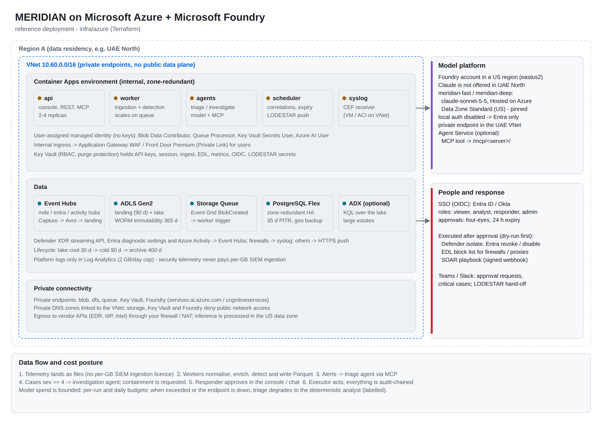

# MERIDIAN on Microsoft Azure + Microsoft Foundry - Low-Level Design

| Item | Value |
| --- | --- |
| Product | MERIDIAN 1.0.1 |
| Document | Low-Level Design, Azure option |
| IaC | `infra/azure` (Terraform >= 1.9, azurerm ~> 5.7) |
| Runtime config | `config/examples/azure.yaml` (mounted as `MERIDIAN_CONFIG`) |
| Related | HLD.md, LLD-aws.md, SECURITY.md, OPERATIONS.md, MCP-TOOLS.md |

## 1. Deployment view



Everything runs in one resource group in the data-residency region (`location`). The Foundry account can sit in a different region (`foundry_location`) when Claude models are not offered in the home region; traffic still uses the private endpoint in the home VNet.

## 2. Resource inventory

| Terraform resource | Name pattern | Configuration | Purpose |
| --- | --- | --- | --- |
| `azurerm_resource_group.rg` | `rg-<prefix>` | tags | Container for all resources |
| `azurerm_virtual_network.vnet` | `vnet-<prefix>` | `vnet_cidr` (default 10.60.0.0/16) | Private network |
| `azurerm_subnet.apps` | `snet-apps` | /23, delegated to `Microsoft.App/environments` | Container Apps environment |
| `azurerm_subnet.pe` | `snet-private-endpoints` | /24 | Private endpoints |
| `azurerm_subnet.pg` | `snet-postgres` | /24, delegated to `Microsoft.DBforPostgreSQL/flexibleServers` | PostgreSQL private access |
| `azurerm_private_dns_zone.z` (x7) | privatelink zones | blob, dfs, queue, vault, services.ai, cognitiveservices, postgres | Private name resolution |
| `azurerm_storage_account.lake` | `st<prefix><sfx>` | StorageV2, ZRS, HNS, TLS 1.2, shared keys disabled, public network disabled, infrastructure encryption | Landing + lake |
| `azurerm_storage_container.landing` / `.lake` | `landing`, `lake` | private | Raw batches / Parquet |
| `azurerm_storage_container_immutability_policy.lake_worm` | - | `lake_retention_days` (default 365) | WORM retention for the lake |
| `azurerm_storage_management_policy.tiering` | - | lake: cool 30 d, cold 90 d, archive 400 d; landing: cool 7 d, delete 90 d | Storage cost control |
| `azurerm_storage_queue.landing` / `.poison` | `meridian-landing`, `meridian-landing-poison` | - | Work notifications / parked messages |
| `azurerm_eventgrid_system_topic.lake` + subscription | `egt-<prefix>`, `landing-to-queue` | BlobCreated, subject `/blobServices/default/containers/landing/`, managed-identity delivery | New batch notification |
| `azurerm_eventhub_namespace.ehn` | `evhns-<prefix>-<sfx>` | Standard, 2 TU, auto-inflate to 10 | Streaming exports |
| `azurerm_eventhub.telemetry` (x3) | `mde`, `entra`, `azure-activity` | 4 partitions, Capture Avro every 60 s or 100 MB to `landing` | Defender XDR, Entra and Activity logs |
| `azurerm_postgresql_flexible_server.pg` | `psql-<prefix>-<sfx>` | PostgreSQL 16, GP_Standard_D2ds_v5, 64 GB, zone-redundant HA, 35-day PITR, geo-redundant backup, private access | Operational store |
| `azurerm_key_vault.kv` | `kv-<prefix>-<sfx>` | RBAC, purge protection, private endpoint; public access only for `deployer_cidrs` when set | Secrets |
| `azurerm_role_assignment.deployer_kv` | - | Key Vault Secrets Officer for the identity running Terraform | Lets Terraform create the secret placeholders |
| `azurerm_user_assigned_identity.app` | `id-<prefix>` | - | Single workload identity |
| `azurerm_cognitive_account.foundry` | `aif-<prefix>-<sfx>` | kind AIServices, S0, `local_auth_enabled = false`, public network disabled, project management enabled | Microsoft Foundry resource |
| `azurerm_cognitive_account_project.meridian` | `meridian` | system-assigned identity | Foundry project (agents, evaluations, tracing) |
| `azurerm_cognitive_deployment.models` | `meridian-fast`, `meridian-deep` | `claude-sonnet-5-5`, version 2 (Hosted on Azure), `DataZoneStandard` (US); validation refuses Anthropic-hosted version 1 | Model deployments |
| `azurerm_container_app_environment.env` | `cae-<prefix>` | internal load balancer, zone redundant, VNet-integrated | Compute |
| `azurerm_container_app.role` (x4) | `ca-<prefix>-api`, `-worker`, `-agents`, `-scheduler` | see section 6 | Workloads |
| `azurerm_log_analytics_workspace.platform` | `log-<prefix>` | PerGB2018, 30 days, 2 GB/day cap | Platform logs only |
| `azurerm_kusto_cluster.adx` + database (optional) | `adx<prefix><sfx>` | `enable_adx = true` | KQL engine for large estates |

## 3. Network design

| Subnet | CIDR (default) | Contents | Inbound | Outbound |
| --- | --- | --- | --- | --- |
| snet-apps | 10.60.0.0/23 | Container Apps environment (internal) | Corporate network via your Application Gateway WAF / Front Door Premium (Private Link) to the api app only | Private endpoints; vendor APIs (Defender, Graph, intel) through your firewall / NAT |
| snet-private-endpoints | 10.60.4.0/24 | Private endpoints: blob, dfs, queue, vault, Foundry | snet-apps | - |
| snet-postgres | 10.60.5.0/24 | PostgreSQL Flexible Server | snet-apps (5432) | - |

* Storage, Key Vault, Foundry and PostgreSQL deny public network access. Storage keeps the `AzureServices` bypass so that Event Hubs Capture and Event Grid (trusted services) can reach it.
* Private DNS zones are linked to the VNet. If you use a hub-and-spoke model with central DNS, link the zones to the hub instead and remove the spoke links.
* The Foundry private endpoint registers in both `privatelink.services.ai.azure.com` and `privatelink.cognitiveservices.azure.com`.
* Users reach the console through your edge (Application Gateway WAF or Front Door Premium with Private Link). Set `public_url` to that URL; it is used for the OIDC redirect URI and in notifications.
* Syslog: set `syslog_receiver = true` to run the TLS syslog receiver as a Container App (TCP 6514 on the environment's internal IP; certificate and key from Key Vault `syslog-tls-cert` / `syslog-tls-key`). Container Apps cannot receive UDP: UDP-only devices send to a site relay (rsyslog / syslog-ng) that forwards over TLS. See LOG-00 §4.3.

## 4. Identity and access

### 4.1 Workload identity (no keys)

All four Container Apps run as the user-assigned identity `id-<prefix>`. `AZURE_CLIENT_ID` is set so that `DefaultAzureCredential` picks it up.

| Scope | Role | Used for |
| --- | --- | --- |
| Storage account | Storage Blob Data Contributor | Read landing, write lake (DuckDB / SDK) |
| Storage account | Storage Queue Data Message Processor | Receive and delete queue messages |
| Storage account | Storage Queue Data Message Sender | Park poison messages in `meridian-landing-poison` |
| Key Vault | Key Vault Secrets User | Secret references in Container Apps |
| Foundry account | Azure AI User | Call model deployments (`https://ai.azure.com/.default` token) |
| Container registry | AcrPull | Pull the image |

The Event Grid system topic has its own identity with Storage Queue Data Message Sender on the account.

Hardening option: split the identity into `id-<prefix>-ingest` (lake write, queue) and `id-<prefix>-agents` (lake read, Foundry), mirroring the AWS design. The reference uses one identity to keep onboarding short; SECURITY.md lists this as a recommended production change for regulated estates.

### 4.2 Entra ID app registrations (created by the platform team)

| App registration | Type | Configuration | Used by |
| --- | --- | --- | --- |
| MERIDIAN Console | Web, confidential | Redirect URI `<public_url>/auth/callback`; groups claim (or app roles); client secret stored as `oidc-client-secret` | Analyst SSO |
| MERIDIAN MCP | API (expose an API), Application ID URI `api://meridian-mcp` | App roles such as `Lake.Read`, `Context.Read`, `Cases.Write`, `Response.Request` | Foundry Agent Service / other remote MCP clients |

Configuration mapping (`security` section):

```yaml
security:
  oidc:
    role_map: {"<group object id - SOC analysts>": analyst, "<group - SOC responders>": responder, "<group - SOC admins>": admin}
    mcp_audience: api://meridian-mcp
  mcp_scope_map:
    Lake.Read: [lake:read]
    Context.Read: [context:read]
    Cases.Write: [cases:read, cases:write]
    Response.Request: [response:request]
```

### 4.3 Secrets

| Key Vault secret | Container env var | Content |
| --- | --- | --- |
| meridian-database-url | MERIDIAN_DATABASE_URL | `postgresql+psycopg://...?sslmode=require` (generated by Terraform) |
| meridian-api-keys | MERIDIAN_API_KEYS | `role:key,...` (roles viewer / analyst / responder / admin; keys >= 16 chars) for automation |
| meridian-session-secret | MERIDIAN_SESSION_SECRET | Cookie signing key (>= 32 random bytes) |
| meridian-ingest-secret | MERIDIAN_INGEST_SECRET | HMAC key for `/api/ingest/{source}` |
| meridian-edl-token | MERIDIAN_EDL_TOKEN | Token firewalls use to pull `/edl/*.txt` |
| meridian-metrics-token | MERIDIAN_METRICS_TOKEN | Prometheus scrape token |
| meridian-agent-tokens | MERIDIAN_AGENT_TOKENS | `name:token:scope+scope` for remote MCP clients without Entra |
| oidc-client-secret | OIDC_CLIENT_SECRET | Console app secret |
| lodestar-webhook-secret | LODESTAR_WEBHOOK_SECRET | Signed hand-off to LODESTAR |

Terraform creates the placeholders with the value `set-me` and ignores later value changes, so real values never enter Terraform state. Set real values with `az keyvault secret set` after apply. `/readyz` returns 503 and lists the variables while any placeholder value is still present, so a half-configured deployment never receives traffic.

## 5. Data flows on Azure

### 5.1 Telemetry onboarding

| Source | Mechanism | Landing prefix | Mapper |
| --- | --- | --- | --- |
| Microsoft Defender XDR (advanced hunting events, alerts) | Defender XDR streaming API to Event Hub `mde` | `mde/...` (Capture Avro) | `mde` |
| Entra ID sign-in and audit logs | Diagnostic settings to Event Hub `entra` | `entra/...` | `entra` |
| Azure Activity log | Subscription diagnostic settings to Event Hub `azure-activity` | `azure-activity/...` | `json` (field map in the source entry of `azure.yaml`) |
| Firewalls, proxies, DNS (CEF) | Syslog receiver | `firewall/...`, `proxy/...` | `cef` |
| Windows servers and DCs, Sysmon | Event Forwarding to a collector, NXLog CE to the TLS syslog receiver (or Fluent Bit push) | `syslog/...` or `windows/...` | `syslog` / `windows` |
| Linux, network and OT devices | rsyslog / syslog-ng over TLS (UDP devices through a site relay) | `syslog/...` | `syslog` |
| Microsoft 365 audit, Okta and other SaaS APIs | API collector (`collector` app, `pull:` blocks; credentials via `extra_secrets`) | `<source>/...` | `json` (field map) |
| SaaS / anything with a webhook or a shipper | `POST /api/ingest/{source}` with HMAC or a source token; Splunk HEC senders to `/services/collector` | `<source>/...` | per source config |
| Threat intel | Files in `config/intel` (CSV, STIX 2.1, TXT), refreshed by your pipeline | - | context loader |

Capture writes blobs named `<hub>/<namespace>/<hub>/<partition>/<yyyy>/<MM>/<dd>/<HH>/<mm>/<ss>.avro`. The worker reads the Avro `Body` field, unwraps `records` arrays (diagnostic settings) and maps each record.

### 5.2 Ingestion sequence (Azure specifics)

1. Event Hubs Capture writes an Avro blob to `landing` every 60 s (or 100 MB) and skips empty windows.
2. Event Grid publishes `Microsoft.Storage.BlobCreated` and delivers it to the `meridian-landing` queue using its managed identity.
3. A worker receives up to 10 messages with a 15-minute visibility timeout. Each message body is base64-encoded JSON.
4. The worker processes each batch as described in HLD 7.1 and deletes the message after success.
5. A message delivered more than 5 times (`queue.max_attempts`) is copied to `meridian-landing-poison` and deleted. An alert on poison queue length is part of OPERATIONS.md.

### 5.3 Lake access

* Workers write Parquet through the Azure SDK (`overwrite=False`). Re-writing an existing file is treated as success, which keeps the immutability policy and idempotency compatible.
* DuckDB (default engine) reads `abfss://lake@<account>.dfs.core.windows.net/events/**` with the `azure` extension and the `credential_chain` provider (managed identity). Hive partitions (`cls`, `dt`, `hr`) are pruned from the WHERE clause.
* ADX (optional). The reference Terraform creates the cluster and database only. Complete these post-apply steps:
  1. Add a private endpoint for the cluster (sub-resource `cluster`, zone `privatelink.<region>.kusto.windows.net`) in `snet-private-endpoints`, because the cluster has public access disabled.
  2. Run `infra/azure/adx-schema.kql` in the `meridian` database.
  3. Grant the workload identity the database Viewer role (the command is at the end of the KQL file).
  4. Grant the cluster's identity Storage Blob Data Reader on the lake account, and create an Event Grid data connection from the `lake` container (`events/` prefix, Parquet, mapping `MeridianParquet`).
  5. Set `lake.query_engine: adx` and `lake.adx.cluster_uri`.

  The engine sends KQL with declared query parameters to `/v1/rest/query` using a managed-identity token.

### 5.4 Model invocation

* Provider `anthropic_foundry` uses the Anthropic SDK's Foundry client with `resource = <custom subdomain>` and an Entra token provider (`DefaultAzureCredential`, scope `https://ai.azure.com/.default`). No API key exists because local auth is disabled.
* `model.fast.deployment` (triage, tune) and `model.deep.deployment` (investigate, hunt) are deployment names, not model ids.
* For OpenAI-compatible deployments use provider `foundry_openai`. It calls `https://<resource>.openai.azure.com/openai/v1/chat/completions` with scope `https://cognitiveservices.azure.com/.default`.
* Pricing for spend tracking goes in `model.pricing` as `{deployment: [input $/M tokens, output $/M tokens]}`. Take the values from your Foundry price sheet.

## 6. Compute

| App | Command | CPU / memory | Replicas | Scaling | Ingress |
| --- | --- | --- | --- | --- | --- |
| api | `serve --host 0.0.0.0 --port 8090` | 1.0 / 2 Gi | 2-4 | HTTP concurrency | Internal, port 8090 |
| worker | `worker` | 1.0 / 2 Gi | 1-10 | Azure Queue length (KEDA), added post-apply (see below) | None |
| agents | `agents` | 0.5 / 1 Gi | 1-4 | Manual / CPU | None |
| scheduler | `scheduler` | 0.5 / 1 Gi | 1 (singleton) | None | None |

Probes: liveness `/healthz` and readiness `/readyz` on the api. The worker, agents and scheduler write a heartbeat into the store at most every 30 s; `/readyz` reports their ages and `/metrics` exposes `meridian_heartbeat_age_seconds{role}` for alerting.

Queue-based worker scaling (KEDA `azure-queue` scaler with workload identity). Run this once after apply, because the azurerm provider does not yet expose identity-based custom scale rules:

```bash
az containerapp update -g rg-<prefix> -n ca-<prefix>-worker \
  --scale-rule-name landing-queue --scale-rule-type azure-queue \
  --scale-rule-metadata accountName=<lake account> queueName=meridian-landing queueLength=20 \
  --scale-rule-identity <id-<prefix> resource id>
```

## 7. Managed agent option: Foundry Agent Service

Use this option when the platform team wants agents to live in Foundry (tracing, evaluations, the Foundry portal). MERIDIAN keeps the data, the rules, the cases and the approvals. The steps:

1. Expose MERIDIAN's MCP endpoints to the Foundry project. Use the api app's internal FQDN through your private ingress, at `https://<public_url>/mcp/lake/`, `/mcp/context/`, `/mcp/cases/` and `/mcp/response/`.
2. Configure MCP authentication in Foundry with the project's managed identity (or OAuth identity passthrough). Set the audience to `api://meridian-mcp` and grant the project identity the app roles it needs (for example `Lake.Read` and `Context.Read` for a triage agent).
3. Add the servers as MCP tools, or group them in a Toolbox:
   * set `allowed_tools` per agent;
   * set `require_approval: always` for `request_containment`, even though MERIDIAN also requires human approval before execution.
4. Use the MERIDIAN system prompt from `meridian/agents/definitions.py` (BASE + role text), and require the structured output schema for each role.
5. Write results back through `cases.add_case_note`. Containment can only be requested; approval stays in MERIDIAN.

MERIDIAN validates the token (issuer, audience, expiry, signature through JWKS), maps app roles to scopes, and enforces the same row and time limits as for built-in agents. Every call is recorded in the audit chain as `tool:<name>` with the caller's identity.

## 8. Response integrations on Azure

| Action | API | Permission (application, granted to a dedicated app registration or the workload identity) | Target format |
| --- | --- | --- | --- |
| isolate_device | Defender for Endpoint `POST /api/machines/{id}/isolate` | Machine.Isolate | Defender device id (alphanumeric, 8-64 chars) |
| revoke_sessions | Microsoft Graph `POST /users/{id}/revokeSignInSessions` | User.RevokeSessions.All | UPN or object id |
| disable_user | Microsoft Graph `PATCH /users/{id}` `accountEnabled=false` | User.EnableDisableAccount.All | UPN or object id |
| block_indicator | MERIDIAN EDL `/edl/ip.txt`, `/edl/domain.txt` pulled by firewalls / proxies | EDL token | Public IP / CIDR <= /24, domain |
| soar_playbook | Signed webhook to your SOAR / Logic App | Webhook secret | Playbook name |

All actions run only from the api app, after an approved decision, and start as dry runs (`response.dry_run: true`). Enable live execution per action with `response.actions.<action>.dry_run: false` after a tabletop test.

## 9. Observability

| Signal | Where | Notes |
| --- | --- | --- |
| Application logs | stdout in JSON (`MERIDIAN_LOG_FORMAT=json`) to Log Analytics `log-<prefix>` | 30 days; 2 GB/day cap; contains no event payloads |
| Metrics | `/metrics` (Prometheus text, bearer `MERIDIAN_METRICS_TOKEN`) | Ingest batches/events, alerts by severity, queue depth, agent runs/outcomes/spend, approvals pending |
| Agent traces | `agent_runs` table (transcripts truncated), Foundry tracing when using Agent Service | Reviewed in the console under Runs |
| Audit | `audit` table hash chain; `meridian verify-audit` | Recommended: run `verify-audit` daily from the scheduler host and keep the PostgreSQL backups for the audit retention period |

Recommended alerts:

* poison queue length > 0;
* `meridian_heartbeat_age_seconds` > 300 for any role;
* landing queue age > 15 min;
* `/readyz` failing;
* agent degraded runs > 0 in 1 h;
* daily spend > 80% of budget;
* approvals pending > 4 h.

## 10. Backup, DR and availability

| Component | Mechanism | RPO | RTO |
| --- | --- | --- | --- |
| Lake | ZRS + immutability; optional object replication to a paired-region account | 0 (in region) | Rebuild compute (IaC) |
| Landing | ZRS, 90 days; replayable with `meridian replay --prefix <source>/<yyyy>/<mm>/<dd>` | 0 | - |
| PostgreSQL | Zone-redundant HA (automatic failover), 35-day PITR, geo-redundant backup | < 5 min | < 1 h in region, about 4 h cross-region |
| Configuration | Git (rules, config) + Key Vault (soft delete, purge protection) | 0 | Minutes |
| Compute | Stateless containers; redeploy with Terraform | - | < 30 min |

Regional DR runbook (summary): restore PostgreSQL geo-backup in the paired region, apply `infra/azure` with the new region and a replicated or new storage account, and repoint exports (Event Hubs diagnostic settings). Detection resumes; history remains in the original lake.

## 11. Sizing guide

| Daily volume | Workers | Event Hubs TU | PostgreSQL | Engine | Notes |
| --- | --- | --- | --- | --- | --- |
| < 50 GB | 1-2 | 2 | D2ds_v5 | DuckDB | Reference defaults |
| 50-300 GB | 2-6 | 4-10 (auto-inflate) | D4ds_v5 | DuckDB | Increase api memory for hunts |
| 300 GB - 2 TB | 6-10+ | Premium / Dedicated | D8ds_v5 | ADX (Dev/Standard cluster) | Enable `enable_adx` and the data connection |

## 12. Deployment procedure

1. Prerequisites:
   * a subscription with quota for Claude deployments in `foundry_location`;
   * an ACR with the MERIDIAN image (`docker build -t <acr>/meridian:1.0.1 .`);
   * the two Entra app registrations (4.2);
   * a remote Terraform state backend.
2. `cp infra/azure/terraform.tfvars.example terraform.tfvars` and set `prefix`, `location`, `foundry_location`, `image`, `acr_id`, `public_url`, `oidc_client_id` and `model_deployments`. Key Vault has no public access, so the first apply uses `deployer_cidrs` (the runner's egress IP, opened only on Key Vault); later applies run from a runner inside the VNet or a peered hub with `deployer_cidrs = []` (deployment/DEPLOY-AZURE.md).
3. `terraform init && terraform plan -out tf.plan && terraform apply tf.plan`.
4. Set the Key Vault secrets (4.3) and restart the revisions.
5. Run the KEDA scale-rule command (section 6).
6. Configure exports:
   * the Defender XDR streaming API to `mde`;
   * Entra diagnostic settings to `entra`;
   * subscription Activity to `azure-activity`;
   * syslog listener (3);
   * HTTPS push senders with the ingest secret.
7. Load context: CMDB and identity CSVs and intel files (`config/assets.csv`, `config/identities.csv`, `config/intel/`). Mount them from an Azure Files share, or bake them into a derived image.
8. Run `meridian doctor` in the api container (`az containerapp exec`), then `meridian eval` against the golden set with the Foundry deployments. See deployment/DEPLOY-AZURE.md step 9.
9. Keep `response.dry_run: true` for the first two weeks, then enable live execution per action.

## 13. Open items to confirm at deployment

* The model deployment `format`, `name` and `version` for Claude models as shown in your Foundry model catalog (the variable defaults are placeholders).
* Regional availability and quota of Claude models; set `foundry_location` accordingly.
* Whether your organisation allows Event Hubs local authentication for diagnostic settings (`local_authentication_enabled = true` in the reference). If not, use managed-identity diagnostic settings where supported.
